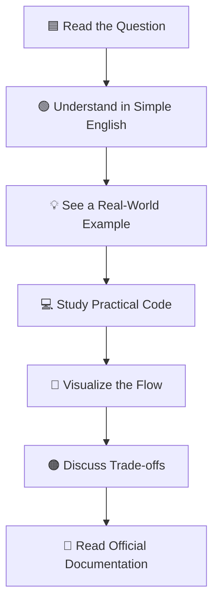
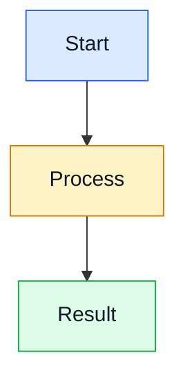
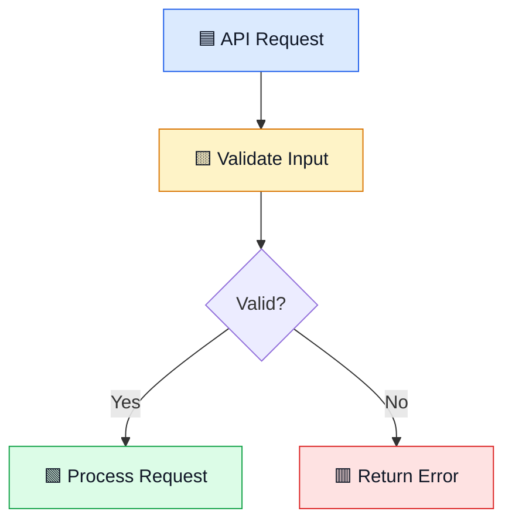
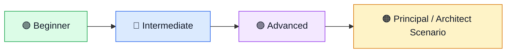

# 🎨 Interview Notes Style Guide

> A beginner-friendly visual learning format for backend, cloud, architecture, and GenAI interview preparation.

## 🌈 Learning Pattern

Every question should follow this sequence:



## 🧩 Recommended Question Template

```markdown
## 🟦 Question 1: Write the question in clear language

### 🟢 Simple Explanation
Explain the concept using short sentences and familiar examples.

### 🏠 Real-World Analogy
Connect the concept to an everyday situation.

### 💡 When Should You Use It?
- Use case 1
- Use case 2
- Important limitation

### 💻 Practical Code Example

```csharp
// Keep the example small and readable.
// Explain important steps with useful comments.
```

### 🔄 Simple Visual Diagram



### 🎯 Interview Answer
Give a short answer that can be spoken in 30–60 seconds.

### ⚖️ Trade-offs and Common Mistakes
- Mention the main benefit.
- Mention the main limitation.
- Explain when not to use the approach.

### 📋 Quick Revision
- Key point 1
- Key point 2
- Key point 3

### 🔗 Official Documentation
- Add relevant documentation links from Microsoft, Python, PostgreSQL, or other authoritative sources.
```

## 🎨 Mermaid Color Convention

Use colors consistently to make diagrams easier to scan:

- **Blue (`#dbeafe`)** — input, request, or starting point
- **Yellow (`#fef3c7`)** — decision, processing, or trade-off
- **Green (`#dcfce7`)** — success, output, or recommended result
- **Red (`#fee2e2`)** — failure, risk, or incident
- **Purple (`#f3e8ff`)** — AI, RAG, data, or advanced concepts

Example:



## ✍️ Writing Rules

1. Use short paragraphs and plain English.
2. Explain new technical terms before using them heavily.
3. Prefer one focused example over a large code listing.
4. Add comments that explain **why**, not obvious syntax.
5. Include edge cases, failure modes, security, scalability, and observability where relevant.
6. Avoid unnecessary complexity and unexplained jargon.
7. Keep question titles visually prominent and consistent.
8. Do not duplicate existing questions; search the repository before adding a new topic.
9. Use official documentation links wherever possible.
10. End each question with a short revision section.

## 🎯 Interview Difficulty Progression



The purpose is not only to memorize answers. The learner should be able to explain **what**, **why**, **how**, **when**, and **what can go wrong**.
