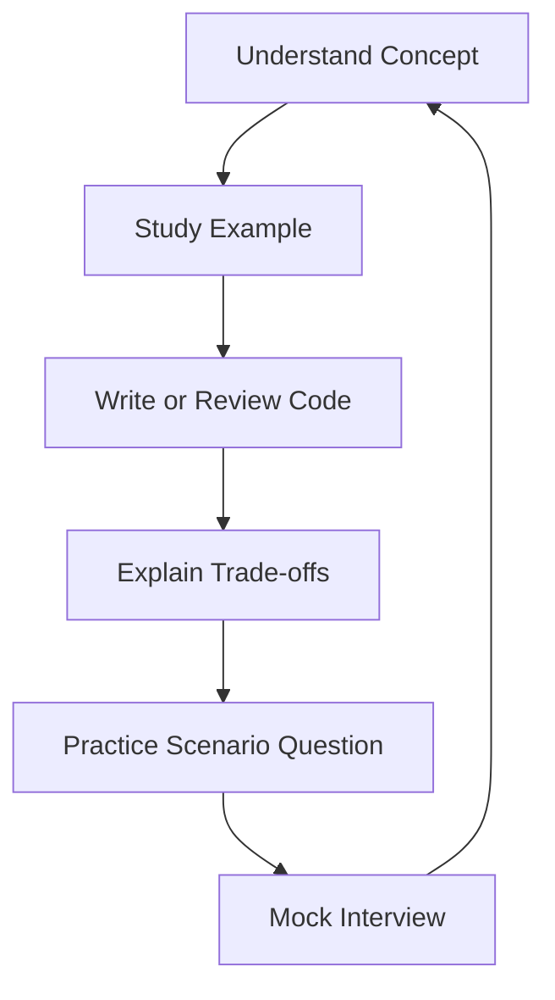

# 🚀 Engineering Interview Prep

[](https://learn.microsoft.com/en-us/dotnet/)
[](https://learn.microsoft.com/en-us/azure/)
[](#topics)
[](#how-to-use-this-repository)
[](#daily-learning-plan)
[](https://leetcode.com/studyplan/top-interview-150/)

A practical, continuously improving interview-preparation knowledge base for **backend engineers, Principal Engineers, Solution Architects, cloud engineers, and GenAI engineers**.

> Learn the concept → explain the design → write the code → discuss trade-offs → handle production scenarios.

## 🏷️ Repository Tags

`csharp` `dotnet` `aspnetcore` `python` `sql` `azure` `paas` `data-factory` `system-design` `microservices` `distributed-systems` `genai` `rag` `llm` `dsa` `leetcode` `principal-engineer` `solution-architect` `interview-preparation`

## 📚 Topics

| # | Topic | Focus |
|---|---|---|
| 1 | [C# and .NET Core](01-CSharp-DotNet-Core.md) | Language, runtime, ASP.NET Core, performance, resilience |
| 2 | [SOLID Principles](02-SOLID-Principles.md) | Maintainable and testable object-oriented design |
| 3 | [Top 5 Design Patterns](03-Top-5-Design-Patterns.md) | Reusable object-oriented design solutions |
| 4 | [Architectural Patterns](04-Architectural-Patterns.md) | Microservices, clean architecture, CQRS, event-driven systems |
| 5 | [GenAI and RAG](05-GenAI-RAG-Interview-QA.md) | Retrieval, evaluation, security, agents, production design |
| 6 | [Python](06-Python-Interview-QA.md) | Core Python, async programming, APIs, testing |
| 7 | [SQL](07-SQL-Interview-QA.md) | Querying, indexing, transactions, optimization |
| 8 | [Azure PaaS](08-Azure-PAAS-Interview-QA.md) | Azure services, identity, networking, observability |
| 9 | [Azure Data Factory](09-Azure-Data-Factory.md) | ETL/ELT, incremental loads, triggers, CI/CD |
| 10 | [DSA — LeetCode Top Interview 150](DSA-LeetCode-150/README.md) | Patterns, complexity, interview questions, optimized C# solutions |

## 🧠 DSA — LeetCode Top Interview 150

Use the **official LeetCode Top Interview 150** as the canonical problem list: [LeetCode Top Interview 150](https://leetcode.com/studyplan/top-interview-150/). LeetCode describes it as a set of 150 classic interview questions covering comprehensive interview topics. citeturn0search0

The repository documents each problem using a consistent interview-first format:

- Problem link, difficulty, topic, pattern, data structure and algorithm
- Explanation with examples and interviewer clarifying questions
- Brute-force approach, C# solution and complexity
- Brute-force drawbacks and bottleneck analysis
- Optimized approach, C# solution and complexity
- Dry run and edge cases
- Further optimization discussion where applicable

**Current progress:** **7 / 150** documented. See the [DSA problem index](DSA-LeetCode-150/README.md).

## 🔄 Learning Flow



## 🎯 Question Format

Each topic is progressively enhanced with:

- 🟢 Fundamentals and definitions
- 🔵 Practical code examples
- 🟣 Architecture and Mermaid flow diagrams
- 🟠 Production scenarios and troubleshooting
- 🔴 Security, scalability, reliability, and observability
- 🔗 Official documentation and further reading

## 🗓️ Daily Learning Plan

The content is intended to grow through daily additions. DSA solutions should be added incrementally without duplicating existing problems, while keeping the problem index synchronized with the solution files.

Suggested daily routine:

1. Read 5–10 questions.
2. Explain answers aloud in 60–120 seconds.
3. Implement or modify one code example.
4. Solve one DSA problem from the current index.
5. Draw the architecture from memory.
6. Record trade-offs and follow-up questions.

## 🧭 Interview Answer Framework

Use this structure for system-design and scenario questions:

```text
Clarify Requirements → State Assumptions → Propose Design → Explain Data Flow
→ Discuss Failure Modes → Security → Scalability → Observability → Trade-offs
```

## Reference Sources

- [Microsoft Learn](https://learn.microsoft.com/)
- [.NET Documentation](https://learn.microsoft.com/en-us/dotnet/)
- [Azure Architecture Center](https://learn.microsoft.com/en-us/azure/architecture/)
- [Python Documentation](https://docs.python.org/3/)
- [SQL Server Documentation](https://learn.microsoft.com/en-us/sql/)
- [LeetCode Top Interview 150](https://leetcode.com/studyplan/top-interview-150/)
