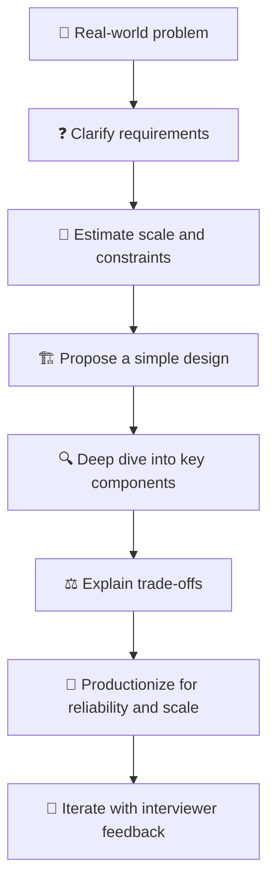
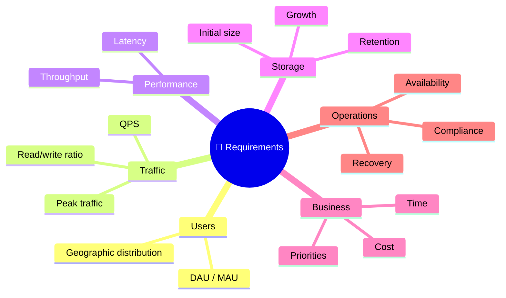
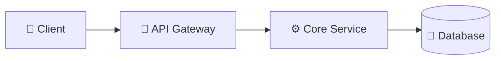

# 🌈 Google System Design Interview Guide

> **Source note:** These preparation guidelines were shared with **Azam by Google recruiter Danish Shams** in an email titled **“System Design: Prep Materials for Google Interviews”** on **October 5, 2023**. This document reorganizes those recommendations into an interview-ready, visual study guide.

---

## 🧭 1. What Is a System Design Interview?

A system design interview is a collaborative conversation in which you design a solution to a real-world engineering problem.

The problem may involve:

- 🏗️ Large-scale service architecture — for example, Gmail or Google Maps
- ⚙️ Algorithms and system-level interactions
- 💾 Data storage and retrieval
- 🌐 Network and distributed-system constraints
- 🖥️ Hardware, capacity, and operational limitations

> 🎤 **Interview mindset:** You lead the discussion. When you have deep knowledge in an area, use the opportunity to demonstrate it—but explain your reasoning clearly and invite feedback.



---

## 🔎 2. What Interviewers Look For

### 📊 A. Concrete, Realistic, Quantitative Design

Avoid vague statements such as **“Use a database and scale horizontally.”** Explain the numbers behind the design:

- 👥 Number of users and active users
- 🔄 Requests per second (QPS)
- 📦 Data size and growth rate
- 🖥️ Number of machines or service instances
- ⏱️ Latency and availability targets
- 🌍 Geographic distribution and traffic patterns

### 🔌 B. API and Interface Design

Your APIs should be understandable, consistent, secure, and easy for other teams or systems to integrate with.

Consider:

- Request and response contracts
- Idempotency
- Pagination and filtering
- Authentication and authorization
- Versioning and backward compatibility
- Error handling and timeouts

### ⚡ C. System Properties

Explain what your architecture optimizes for:

| Property | Questions to ask |
|---|---|
| ⚡ Latency | Is the system optimized for fast reads or writes? |
| 📈 Throughput | How much traffic can it process? |
| 🛡️ Availability | What happens when a dependency fails? |
| 🧾 Consistency | Can users temporarily see stale data? |
| 💰 Cost | What is the infrastructure and operational cost? |
| 🔧 Maintainability | Can teams evolve the system safely? |

### ⚖️ D. Trade-offs and Alternatives

Do not simply name a technology. Explain:

1. Why you selected it
2. Which alternatives you considered
3. What you gain
4. What you sacrifice
5. Under which conditions you would change the decision

**Example:**

> “I would use Redis for frequently accessed, short-lived data because it provides low-latency reads. A database remains the source of truth. If durability or very large datasets become the priority, I would evaluate a durable distributed store instead.”

### 🚀 E. Productionization: Reliability and Scale

A design is incomplete until you explain how it runs in production:

- Health checks and automated recovery
- Metrics, logs, traces, and alerting
- Retries with backoff and circuit breakers
- Replication and failover
- Backups and disaster recovery
- Capacity planning and autoscaling
- Safe deployments and rollback strategies

---

## 🧠 3. Preparation Strategy

### 📚 Review Distributed Systems Concepts

Build a strong foundation in:

- CAP theorem and consistency models
- Replication and partitioning
- Consensus and leader election
- Queues, streams, and event-driven architecture
- Caching and cache invalidation
- Load balancing
- Sharding and consistent hashing
- Fault tolerance and disaster recovery
- Distributed transactions and idempotency

### 🧮 Think Across the Full Requirement Spectrum

Always consider:



Ask yourself:

- 🎯 What is an acceptable latency for this user journey?
- 🛡️ How robust is the system under partial failure?
- 📈 How will it scale as users and data grow?
- 🔄 How will the system be productionized?
- 🧩 Which components should remain flexible?
- 🔒 Which decisions should be fixed because they protect system integrity?

---

## 🪜 4. Recommended Interview Approach

### 1️⃣ Scope the Requirements

The problem statement is intentionally incomplete. Ask clarifying questions before designing.

**Useful questions:**

- Who are the users?
- What are the core use cases?
- What is in scope and out of scope?
- What scale should we support?
- What are the latency and availability expectations?
- Is strong consistency required?
- What are the retention, privacy, and security requirements?

### 2️⃣ Design a Simple Baseline

Start with a design that works conceptually. Do not prematurely introduce every distributed-systems component.



Then identify bottlenecks and evolve the architecture based on actual requirements.

### 3️⃣ Stay Flexible

The interviewer may provide hints or change assumptions. Treat the discussion as an iterative design session:

- 🔁 Revisit earlier decisions
- 🧪 Explain what changed and why
- 🧭 State assumptions explicitly
- 🤝 Use interviewer hints as new information

### 4️⃣ Deep Dive into Subsystems

Choose the most important areas based on the problem:

- API and data model
- Storage and indexing
- Caching
- Asynchronous processing
- Consistency and ordering
- Scaling hot partitions
- Security and abuse prevention

### 5️⃣ Iterate and Improve

Evaluate the design against:

> **Scalability · Reliability · Flexibility · Maintainability · Cost**

### 6️⃣ Always Have a Backup Plan

Ask:

> 🌍 “Can this system continue operating if an availability zone, region, dependency, or entire data center becomes unavailable?”

Discuss graceful degradation, failover, recovery point objectives (RPO), and recovery time objectives (RTO).

---

## 🧪 5. Quantitative Design Cheat Sheet

Use assumptions and show your calculations.

| Estimate | Example question |
|---|---|
| 👥 Users | How many registered and daily active users? |
| 🔄 QPS | What are average and peak requests per second? |
| 💾 Storage | How much data is written daily and retained? |
| 🌐 Bandwidth | What is the ingress and egress volume? |
| 🖥️ Compute | How many requests can one instance handle? |
| ⏱️ Latency | What is the p50/p95/p99 target? |
| 🛡️ Availability | What downtime budget is acceptable? |

**Interview habit:** State assumptions, calculate approximate values, and explain how the estimates influence architecture decisions.

---

## 🧰 6. Core Topics to Prepare

- 🔌 API design
- 🏗️ Systems architecture
- 🧮 Capacity, latency, and throughput
- 📈 Scalability
- 🌐 Network design
- 🛡️ Fault tolerance
- ⚖️ System-level interactions and trade-offs

Additional high-value topics:

- Caching and CDNs
- Databases and indexing
- Message queues and stream processing
- Consistency, ordering, and deduplication
- Observability
- Security and privacy
- Disaster recovery
- Cost optimization

---

## 📖 7. Suggested Learning Resources

The recruiter’s email referenced these categories of material:

- ⏱️ *Latency Numbers Every Programmer Should Know*
- ▶️ Videos about building software systems at Google and lessons learned
- 🏢 Software engineering advice from large-scale distributed systems
- 🎯 System design interview preparation guides
- 📚 Distributed systems and parallel computing
- 🗺️ *MapReduce: Simplified Data Processing on Large Clusters*
- 🗃️ *Bigtable: A Distributed Storage System for Structured Data*
- 💽 *The Google File System*

Use these materials to understand principles, not just memorize architectures.

---

## 🎤 8. Interview Conversation Template

```text
1. Clarify the problem and define scope
2. Confirm functional and non-functional requirements
3. Estimate users, traffic, storage, and latency
4. Propose APIs and a high-level architecture
5. Explain the data model and storage choices
6. Walk through the primary request flows
7. Identify bottlenecks and failure modes
8. Deep dive into scalability and reliability
9. Explain alternatives and trade-offs
10. Summarize assumptions and remaining improvements
```

### ⭐ Final Reminder

> **Design for the problem—not for technology fashion.**
>
> A strong answer demonstrates clear assumptions, practical numbers, thoughtful APIs, explicit trade-offs, and a credible production plan.

---

## 🔗 Related Guides in This Repository

- [🛒 E-Commerce / Amazon](./01-E-Commerce-Amazon/solution.md)
- [▶️ YouTube](./02-YouTube/solution.md)
- [💬 WhatsApp](./03-WhatsApp/solution.md)
- [📸 Facebook / Instagram](./04-Facebook-Instagram/solution.md)
- [🔗 URL Shortener](./05-URL-Shortener/solution.md)
- [📝 Google Docs](./06-Google-Docs/solution.md)

---

> 📝 **Attribution and context:** This guide is a structured learning document based on the preparation guidance shared in the recruiter email. It is not presented as an official current Google interview policy or a guarantee of interview content.
