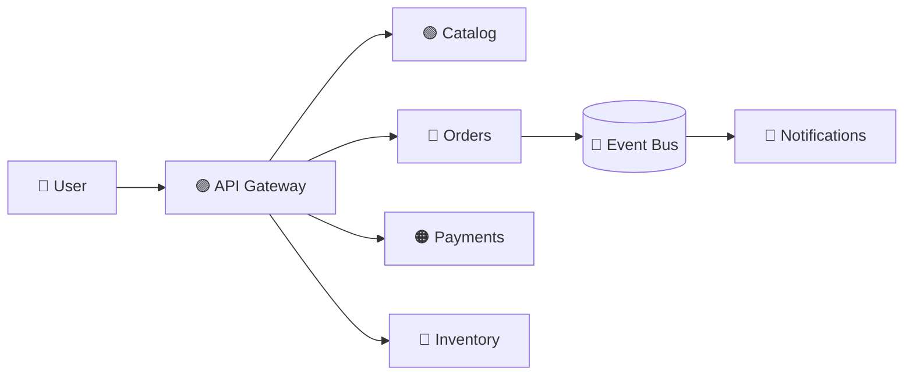

# 🛒 E-Commerce System Design (Amazon-like)

> 📘 **Primary interview guide:** [Open the complete visual solution](01-E-Commerce-Amazon/solution.md)

## 🎯 Core Topics
- Catalog and search
- Cart and checkout
- Inventory consistency
- Payment idempotency
- Event-driven order processing
- Caching, scaling, security, and observability

The detailed solution contains requirements, estimations, data model, APIs, diagrams, bottlenecks, and interview follow-ups.