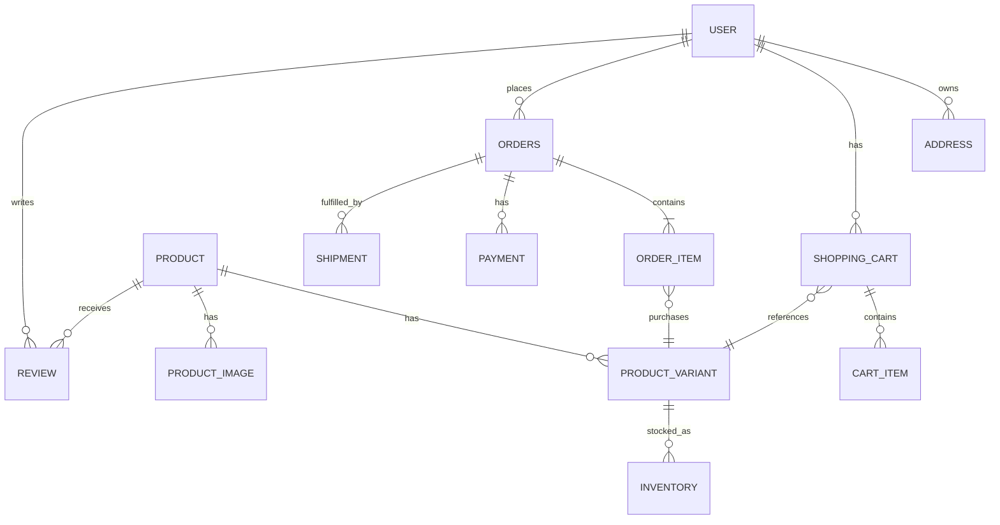

# Amazon-like E-Commerce — Detailed Data Model

## 1. ER Diagram

## 2. Core Entities

### USER

| Field | Type | Key | Description |
|---|---|---|---|
| user_id | UUID | PK | Customer identifier |
| email | varchar(320) | UK | Login email |
| password_hash | varchar(255) | | Hashed password |
| status | varchar(30) | IDX | Active, blocked, deleted |
| created_at | timestamp | | Account creation time |

**Indexes:** unique(email), status, created_at.

### ADDRESS

| Field | Type | Key | Description |
|---|---|---|---|
| address_id | UUID | PK | Address identifier |
| user_id | UUID | FK | Owner |
| address_type | varchar(20) | | Home, office, other |
| line1 | varchar(255) | | Address line |
| city | varchar(100) | | City |
| postal_code | varchar(20) | | Postal code |
| country_code | char(2) | | ISO country |
| is_default | boolean | | Default address flag |

**Indexes:** (user_id, is_default).

### PRODUCT

| Field | Type | Key | Description |
|---|---|---|---|
| product_id | UUID | PK | Product/catalog ID |
| seller_id | UUID | FK/IDX | Seller reference |
| title | varchar(500) | | Display name |
| description | text | | Product details |
| category_id | UUID | FK/IDX | Category |
| status | varchar(30) | IDX | Draft, active, inactive |
| created_at | timestamp | | Creation time |

**Indexes:** category_id, seller_id, status, full-text/search index on title and description.

### PRODUCT_VARIANT

| Field | Type | Key | Description |
|---|---|---|---|
| variant_id | UUID | PK | SKU-level identifier |
| product_id | UUID | FK | Parent product |
| sku | varchar(100) | UK | Stock keeping unit |
| attributes_json | jsonb | | Size, color, model etc. |
| price_minor | bigint | | Price in smallest currency unit |
| currency | char(3) | | Currency code |
| status | varchar(30) | | Active or unavailable |

**Indexes:** unique(sku), product_id, status.

### INVENTORY

| Field | Type | Key | Description |
|---|---|---|---|
| inventory_id | UUID | PK | Inventory row |
| variant_id | UUID | FK/IDX | SKU |
| warehouse_id | UUID | FK/IDX | Fulfillment location |
| available_qty | int | | Sellable units |
| reserved_qty | int | | Reserved during checkout |
| version | bigint | | Optimistic concurrency |
| updated_at | timestamp | | Last update |

**Unique constraint:** (variant_id, warehouse_id). Use atomic conditional updates to prevent overselling.

### SHOPPING_CART / CART_ITEM

| Entity | Field | Type | Key |
|---|---|---|---|
| SHOPPING_CART | cart_id | UUID | PK |
| SHOPPING_CART | user_id | UUID | FK/UK |
| SHOPPING_CART | updated_at | timestamp | |
| CART_ITEM | cart_item_id | UUID | PK |
| CART_ITEM | cart_id | UUID | FK |
| CART_ITEM | variant_id | UUID | FK |
| CART_ITEM | quantity | int | |
| CART_ITEM | unit_price_snapshot | bigint | |

**Index:** (cart_id, variant_id), usually with one active cart per user.

### ORDERS / ORDER_ITEM

| Entity | Field | Type | Key |
|---|---|---|---|
| ORDERS | order_id | UUID | PK |
| ORDERS | user_id | UUID | FK/IDX |
| ORDERS | order_status | varchar(30) | IDX |
| ORDERS | total_amount_minor | bigint | |
| ORDERS | currency | char(3) | |
| ORDERS | shipping_address_snapshot | jsonb | |
| ORDERS | created_at | timestamp | IDX |
| ORDER_ITEM | order_item_id | UUID | PK |
| ORDER_ITEM | order_id | UUID | FK |
| ORDER_ITEM | variant_id | UUID | FK |
| ORDER_ITEM | quantity | int | |
| ORDER_ITEM | unit_price_minor | bigint | |
| ORDER_ITEM | seller_id | UUID | IDX |

Store address and price snapshots so historical orders do not change when profile or catalog data changes.

### PAYMENT

| Field | Type | Key | Description |
|---|---|---|---|
| payment_id | UUID | PK | Payment identifier |
| order_id | UUID | FK/IDX | Related order |
| provider | varchar(40) | | Payment gateway |
| provider_reference | varchar(255) | UK | Gateway reference |
| amount_minor | bigint | | Paid amount |
| status | varchar(30) | IDX | Initiated, captured, failed, refunded |
| idempotency_key | varchar(100) | UK | Duplicate protection |
| created_at | timestamp | | Creation time |

### SHIPMENT

| Field | Type | Key | Description |
|---|---|---|---|
| shipment_id | UUID | PK | Shipment identifier |
| order_id | UUID | FK/IDX | Order |
| warehouse_id | UUID | FK | Fulfillment location |
| carrier | varchar(80) | | Delivery partner |
| tracking_number | varchar(120) | IDX | Tracking ID |
| status | varchar(30) | IDX | Packed, shipped, delivered, returned |
| estimated_delivery_at | timestamp | | ETA |

### REVIEW

| Field | Type | Key | Description |
|---|---|---|---|
| review_id | UUID | PK | Review ID |
| user_id | UUID | FK/IDX | Author |
| product_id | UUID | FK/IDX | Reviewed product |
| rating | smallint | | 1 to 5 |
| title | varchar(200) | | Review title |
| body | text | | Review body |
| status | varchar(30) | IDX | Pending, published, removed |
| created_at | timestamp | | Creation time |

**Constraint:** one review per user/product/order item where business rules require verified purchase.

## 3. Storage Responsibility

| Data | Recommended store | Reason |
|---|---|---|
| Orders, payments | Azure SQL/PostgreSQL | Transactions and consistency |
| Product catalog | SQL + search index | Strong writes and fast discovery |
| Cart | Redis with durable backing store | Low latency and TTL support |
| Inventory | SQL/Cosmos with atomic conditional writes | Prevent overselling |
| Product images | Azure Blob Storage | Large objects and CDN delivery |
| Search | Azure AI Search/OpenSearch | Text, filters, ranking |
| Events | Service Bus/Kafka/Event Hubs | Asynchronous workflows |

## 4. Partitioning and Consistency

- Partition high-volume order and event data by `user_id` or time-based buckets.
- Use `order_id` as the aggregate boundary for order state changes.
- Use idempotency keys for checkout, payment, and shipment commands.
- Use an outbox table to publish reliable domain events after database commits.
- Keep catalog reads eventually consistent with search indexes.
- Keep payment, inventory reservation, and order state transitions auditable.
