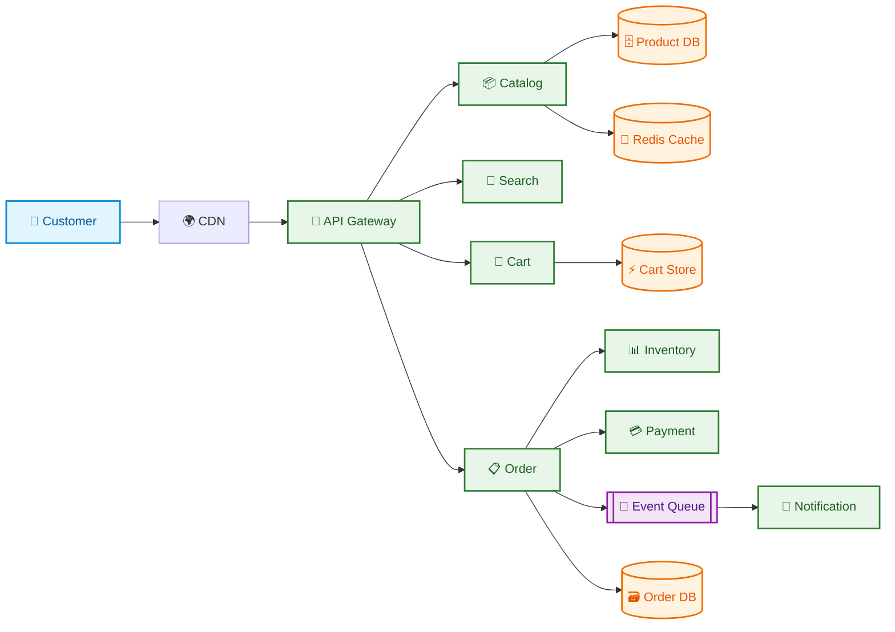

# 🛒 **Amazon-Like E-Commerce System Design**

> 🎯 **Interview goal:** Design a reliable shopping platform where browsing is fast, checkout is safe, inventory is accurate, and every service can scale independently.

---

## 🟣 1. 🧭 Requirement Gathering — *Start with the customer journey*

Ask: How many users? Which countries? Do we need marketplace sellers? Are payments and delivery in scope? Is inventory strongly consistent?

💡 **Think like a shopper:** Discover → Select → Add to cart → Checkout → Pay → Track delivery.

## 🔵 2. ⚙️ Functional Requirements

- Browse and search products.
- View product details, price, stock and reviews.
- Add/remove cart items.
- Place orders and pay.
- Reserve inventory and track order status.
- Admin/seller product management.

## 🟢 3. 🛡️ Non-Functional Requirements

- High availability for browsing.
- Strong consistency for payment and stock reservation.
- Low read latency, target p95 under 300 ms for normal APIs.
- Secure, auditable and fault tolerant.
- Scale independently by service.

## 🟠 4. 📊 Capacity Estimation — *Turn users into numbers*

Assume 10 million daily active users, 20 product reads per user/day and 1 million orders/day.

- Product reads: 200 million/day ≈ 2,300 average requests/second; assume 5x peak ≈ 12,000 RPS.
- Orders: 1 million/day ≈ 12 writes/second average; peak may be 100 RPS.
- Use estimates to justify caching and separate order processing.

## 🟡 5. 💾 Data Estimation

Assume 100 million products at 2 KB of structured data: about 200 GB before indexes and replicas. Images belong in object storage, not the relational database. Orders, payments and inventory require durable storage and backups.

## 🔷 6. 🌐 Network Estimation

If an average product response is 20 KB, 12,000 RPS peak requires about 240 MB/s before compression and CDN effects. Product images are delivered through a CDN.

## 🌈 7. 🏗️ High-Level Design — *Follow the request like a moving story*

### 🎬 Checkout flow in simple steps

1. 🛒 Customer submits the cart.
2. 🔍 Order service validates price, user and cart contents.
3. 📦 Inventory service reserves stock atomically.
4. 💳 Payment service authorizes payment using an idempotency key.
5. 🧾 Order service persists the order.
6. 📨 An event triggers notifications, fulfillment and analytics.
7. 🔁 If a step fails, the workflow performs compensation or reconciliation.

Use separate services for catalog, search, cart, order, inventory, payment and notification. The order service uses a workflow or saga: validate cart → reserve stock → authorize payment → create order → confirm or compensate.

## 🟣 8. 🗂️ Data Model

- `Product(product_id, seller_id, title, description, price, status)`
- `Inventory(product_id, warehouse_id, available, reserved, version)`
- `Cart(user_id, product_id, quantity)`
- `Order(order_id, user_id, status, total, created_at)`
- `OrderItem(order_id, product_id, quantity, price_snapshot)`
- `Payment(payment_id, order_id, status, provider_reference)`

Use optimistic concurrency or atomic database operations for stock. Store price snapshots in order items.

## 🔵 9. 🔌 API Endpoints

- `GET /products?query=&page=`
- `GET /products/{id}`
- `POST /carts/items`
- `PATCH /carts/items/{productId}`
- `POST /orders` with an idempotency key
- `GET /orders/{id}`
- `POST /payments/{orderId}/authorize`
- `POST /orders/{id}/cancel`

## 🟢 10. 🚀 Performance and Caching

Cache product details, categories and search suggestions using cache-aside Redis. Use CDN for images. Do not cache payment state blindly. Use indexes for product filters and search engine technology for full-text search. Use asynchronous queues for emails, analytics and recommendations.

## 🟠 11. 📈 Scaling: Vertical vs Horizontal

Vertical scaling is simple but has hardware limits. Use horizontal scaling for stateless API services behind a load balancer. Add read replicas for catalog reads, partition orders by order ID or customer region, and shard high-volume tables when one database becomes a bottleneck.

## 🟡 12. 🔐 Security, Authentication and Authorization

Use OAuth2/OIDC, short-lived access tokens and MFA for sensitive actions. Enforce server-side authorization for users, sellers and admins. Tokenize payment details; do not store raw card data. Apply TLS, encryption at rest, rate limits, input validation and audit logs.

## 🔷 13. 🔭 Monitoring and Observability

Track request latency, error rate, throughput, stock reservation failures, payment failures, queue lag, cache hit ratio, database CPU and replication lag. Use correlation IDs, structured logs, distributed tracing and alerts tied to SLOs.

## 🌈 🎤 Interview Follow-ups

- **How do you prevent overselling?** Atomic reservation plus idempotency.
- **What if payment succeeds but order creation fails?** Use durable events, reconciliation and compensation.
- **How do you handle a flash sale?** Queue requests, rate limit, hot-key protection and pre-reserved inventory.

> ⭐ **Remember:** Browsing can be eventually consistent, but inventory and payment workflows need strong correctness and auditability.
