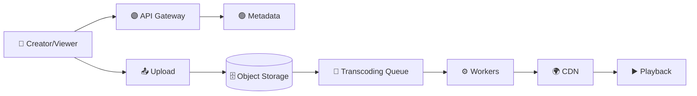

# ▶️ YouTube System Design

> 📘 **Primary interview guide:** [Open the complete visual solution](02-YouTube/solution.md)

## 🎯 Core Topics
- Multipart upload and signed URLs
- Async transcoding and adaptive streaming
- Object storage and CDN delivery
- Search, recommendations, and engagement
- Playback quality, cost, security, and observability

Use the detailed solution for capacity estimates, APIs, data model, scaling, and interview trade-offs.