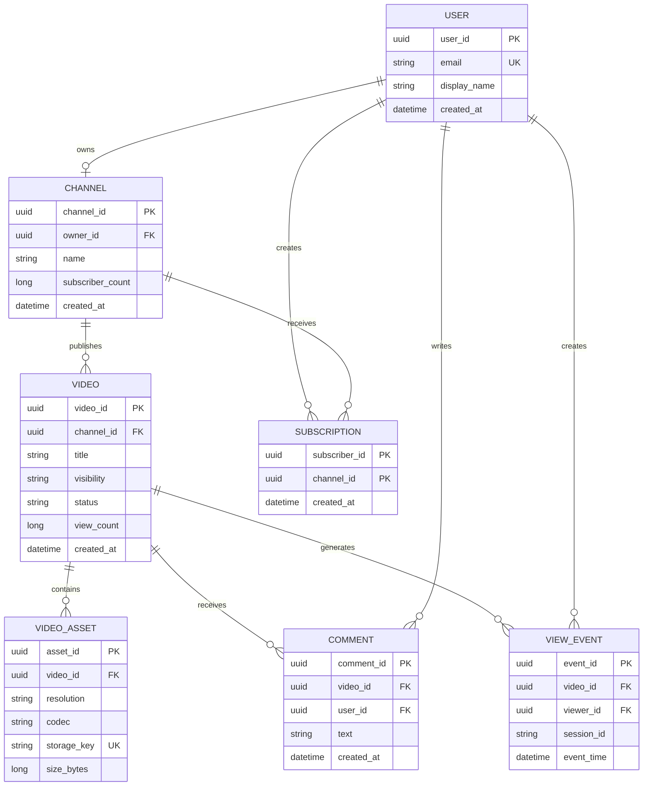

# 🗃️ YouTube Data Model

This document explains the main entities, fields, keys, relationships and storage choices in a clear format.

## 1. Entity Relationship Diagram

## 2. Table Definitions

### USER

| Field | Type | Key | Description |
|---|---|---|---|
| `user_id` | UUID | PK | Unique user identifier |
| `email` | VARCHAR(320) | Unique | Login/contact email |
| `display_name` | VARCHAR(100) | — | Public name |
| `created_at` | TIMESTAMP | Index | Account creation time |

**Storage:** SQL database such as Azure SQL/PostgreSQL. Partition only at very large scale.

### CHANNEL

| Field | Type | Key | Description |
|---|---|---|---|
| `channel_id` | UUID | PK | Channel identifier |
| `owner_id` | UUID | FK → USER | Channel owner |
| `name` | VARCHAR(200) | Index | Channel name |
| `subscriber_count` | BIGINT | — | Approximate denormalized count |
| `created_at` | TIMESTAMP | Index | Creation time |

**Indexes:** `(owner_id)`, `(name)`.

### VIDEO

| Field | Type | Key | Description |
|---|---|---|---|
| `video_id` | UUID | PK | Video identifier |
| `channel_id` | UUID | FK → CHANNEL | Publishing channel |
| `title` | VARCHAR(500) | Index/Search | Video title |
| `visibility` | ENUM | Index | `PUBLIC`, `UNLISTED`, `PRIVATE` |
| `status` | ENUM | Index | `UPLOADING`, `PROCESSING`, `READY`, `BLOCKED` |
| `view_count` | BIGINT | — | Approximate aggregated count |
| `created_at` | TIMESTAMP | Index | Upload time |

**Indexes:** `(channel_id, created_at)`, `(status, created_at)`. Search fields should be copied to a search index.

### VIDEO_ASSET

| Field | Type | Key | Description |
|---|---|---|---|
| `asset_id` | UUID | PK | Rendition identifier |
| `video_id` | UUID | FK → VIDEO | Parent video |
| `resolution` | VARCHAR(20) | Composite | `360p`, `720p`, `1080p`, `4K` |
| `codec` | VARCHAR(30) | — | H.264, H.265, AV1, etc. |
| `storage_key` | VARCHAR(1000) | Unique | Blob Storage object path |
| `size_bytes` | BIGINT | — | Asset size |
| `bitrate` | INT | — | Streaming bitrate |

**Storage:** Metadata in a database; actual media in Azure Blob Storage. Keep objects immutable where possible.

### COMMENT

| Field | Type | Key | Description |
|---|---|---|---|
| `comment_id` | UUID | PK | Comment identifier |
| `video_id` | UUID | FK → VIDEO | Commented video |
| `user_id` | UUID | FK → USER | Comment author |
| `text` | TEXT | — | Comment body |
| `created_at` | TIMESTAMP | Index | Creation time |

**Indexes:** `(video_id, created_at)` for paginated comments. Use cursor pagination instead of large offsets.

### SUBSCRIPTION

| Field | Type | Key | Description |
|---|---|---|---|
| `subscriber_id` | UUID | PK part | User subscribing |
| `channel_id` | UUID | PK part | Subscribed channel |
| `created_at` | TIMESTAMP | — | Subscription time |

**Primary key:** `(subscriber_id, channel_id)` prevents duplicate subscriptions.

### VIEW_EVENT

| Field | Type | Key | Description |
|---|---|---|---|
| `event_id` | UUID | PK | Event identifier or idempotency key |
| `video_id` | UUID | Partition key | Watched video |
| `viewer_id` | UUID | Optional | Viewer, if authenticated |
| `session_id` | VARCHAR(100) | Index | Playback session |
| `event_time` | TIMESTAMP | Sort key | Event timestamp |

**Storage:** Kafka/Event Hubs for ingestion, then a data lake for long-term analytics. Partition by time bucket and hashed `video_id`; do not update the main video row for every view.

## 3. Storage Responsibility Map

| Data | System | Why |
|---|---|---|
| User/channel/transactional records | Azure SQL or PostgreSQL | Relationships and transactional consistency |
| High-scale video metadata | Cosmos DB or sharded SQL | Horizontal partitioning and read scale |
| Video files and thumbnails | Azure Blob Storage | Large durable objects and lifecycle tiers |
| Searchable title/tags | Azure AI Search | Full-text search and ranking |
| Hot metadata and manifests | Redis | Low-latency caching |
| View events | Event Hubs/Kafka | High-throughput append-only ingestion |
| Historical analytics | Data Lake + Parquet | Low-cost retention and analytics |

## 4. Important Design Decisions

1. **Do not store video bytes in SQL.** Store only metadata and Blob Storage keys.
2. **Do not increment `view_count` synchronously for every view.** Aggregate events asynchronously.
3. **Use cursor pagination** for comments and channel videos.
4. **Use soft deletion/status flags** for moderation and recovery workflows.
5. **Use optimistic concurrency** when updating video metadata.
6. **Keep search indexes rebuildable** from the source-of-truth database and event stream.
