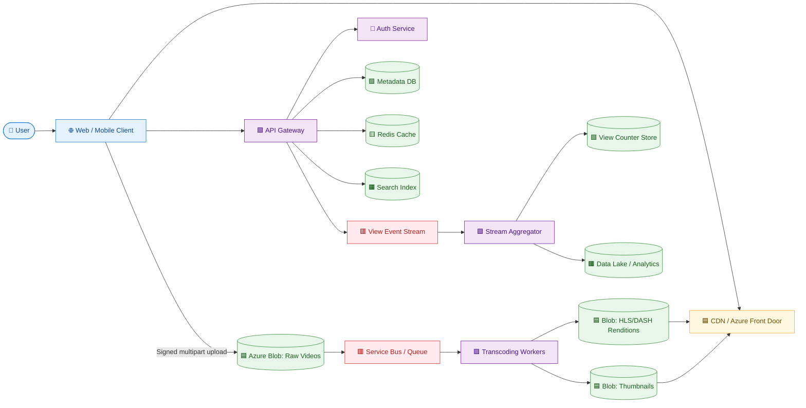

# 🎬 YouTube System Design

> **Scope:** Video upload, processing, playback, metadata, search, comments and view events. Estimates are illustrative and should be confirmed with the interviewer.

## 1. Requirement Gathering

Clarify:
- Target regions and availability SLA
- Maximum upload size and supported formats
- Public, unlisted and private videos
- VOD only or live streaming too
- Expected video quality: 360p, 720p, 1080p, 4K
- Recommendation and monetization scope

## 2. Functional Requirements

- Upload videos using resumable/multipart uploads.
- Store title, description, tags and privacy settings.
- Transcode videos into multiple resolutions and codecs.
- Generate HLS/DASH manifests and thumbnails.
- Stream, pause, seek and resume videos.
- Support likes, comments, subscriptions and reporting.
- Search videos and show approximate view counts.
- Process view events asynchronously.

## 3. Non-Functional Requirements

- High availability and durable media storage
- Low playback startup time and low rebuffering
- Horizontal scalability for viral traffic
- Eventual consistency for views, likes and recommendations
- Secure private-video access
- Fault isolation between API, storage, encoding and playback

## 4. Capacity Estimation: DAU and QPS

| Metric | Assumption |
|---|---:|
| Daily active viewers (DAU) | 100 million |
| Average videos watched per viewer/day | 10 |
| Playback sessions/day | 1 billion |
| Average playback-start QPS | 1B / 86,400 ≈ **11,600 QPS** |
| Peak factor | 5x |
| Peak playback-start QPS | **≈58,000 QPS** |
| Daily video uploads | 2 million |
| Average upload API QPS | 2M / 86,400 ≈ **23 QPS** |
| Peak upload API QPS | **≈115 QPS** |
| Metadata reads | Assume 5x playback starts: ≈58,000 average QPS; ≈290,000 peak QPS |
| View events | Up to one event per playback start; ingest through a queue/stream |

**Important:** Playback traffic is mostly delivered by the CDN. Application QPS and origin QPS are therefore much lower than client request volume when cache hit ratio is high.

## 5. Data and Storage Estimation

### Source video storage

- 2 million uploads/day
- Average source file size: 100 MB
- Raw source storage/day = 2M × 100 MB = **200 TB/day**
- Raw source storage/year ≈ **73 PB/year**

### Transcoded storage

Assume transcoded renditions and thumbnails add 2.5x the source size:

- Transcoded and derived media/day ≈ 200 TB × 2.5 = **500 TB/day**
- Total media/year ≈ **182.5 PB/year**, before replication and backups

Use lifecycle policies to move old content to cooler tiers. Deduplicate where possible and retain original uploads according to business and compliance rules.

### Metadata and event storage

- Video metadata: SQL or document database; relatively small compared with media.
- View events: 1B/day. At an average 200 bytes/event, raw events ≈ **200 GB/day** before indexes, replication and stream overhead.
- Search index: separate distributed search cluster, rebuilt from the source of truth.
- Analytics: object storage/data lake in columnar formats such as Parquet.

## 6. Database and Storage Selection

| Data | Recommended technology | Reason |
|---|---|---|
| Original and encoded videos | Object storage such as Azure Blob Storage | Durable, cheap, supports large immutable objects and lifecycle tiers |
| Video metadata | Azure Cosmos DB or sharded SQL database | Flexible schema, high read scale, partitioning |
| Users, subscriptions, moderation records | SQL database such as Azure SQL/PostgreSQL | Transactions, constraints and relational queries |
| Hot metadata/manifests | Azure Cache for Redis | Low-latency reads and reduced database load |
| Search | Azure AI Search/Elasticsearch/OpenSearch | Full-text search, filtering and ranking |
| Upload/transcoding jobs | Azure Service Bus or Kafka | Durable asynchronous processing and retries |
| View events | Kafka/Event Hubs | High-throughput append-only ingestion |
| Analytics and history | Azure Data Lake Storage + Spark/Synapse | Cheap retention and batch/stream analytics |
| Delivery | CDN such as Azure Front Door/CDN | Edge caching and reduced origin bandwidth |

## 7. High-Level System Design



### Playback flow

1. Client requests video metadata and manifest.
2. API checks Redis and metadata store.
3. Client receives a signed manifest URL.
4. Video segments are requested from the CDN.
5. CDN fetches from encoded Blob Storage only on cache miss.
6. Playback and engagement events are sent asynchronously.

### Upload flow

1. API creates an upload session and returns a signed URL.
2. Client uploads chunks directly to Blob Storage.
3. Upload completion emits a queue message.
4. Workers validate, scan, transcode and generate thumbnails.
5. Metadata changes from `PROCESSING` to `READY` only after validation.

## 8. Data Model

```text
Video(video_id, owner_id, title, description, visibility, status, created_at)
VideoAsset(video_id, resolution, codec, bitrate, storage_key, checksum)
Channel(channel_id, owner_id, name, subscriber_count)
Subscription(user_id, channel_id, created_at)
Comment(comment_id, video_id, user_id, text, created_at)
ViewEvent(event_id, video_id, viewer_id, session_id, timestamp)
```

Partition high-volume data by `video_id`, time bucket or hashed event key. Avoid updating one hot counter for every view.

## 9. API Endpoints

```http
POST /v1/videos/upload-sessions
POST /v1/videos/{videoId}/complete-upload
POST /v1/videos/{videoId}/publish
GET  /v1/videos/{videoId}
GET  /v1/videos/{videoId}/manifest
POST /v1/videos/{videoId}/comments
POST /v1/videos/{videoId}/view-events
GET  /v1/search?q=...
POST /v1/channels/{channelId}/subscribe
```

## 10. Performance and Caching

- Cache popular metadata and manifests in Redis.
- Cache immutable video segments at CDN edges with long TTLs.
- Use origin shielding and request coalescing for viral videos.
- Use adaptive bitrate streaming to reduce rebuffering.
- Aggregate views in batches instead of synchronously updating counters.
- Apply backpressure when transcoding queues grow.

## 11. Scaling: Vertical vs Horizontal

- **Vertical scaling:** temporarily improves a single encoding worker or database node but has a hardware ceiling.
- **Horizontal scaling:** add API replicas, transcoding workers, queue consumers and database partitions.
- Autoscale transcoding based on queue depth and job age.
- Partition event ingestion by video ID or hashed key.
- Keep media storage and delivery independent from metadata APIs.

## 12. Security, Authentication and Authorization

- OAuth/OIDC for user authentication.
- Signed, short-lived upload and playback URLs.
- Malware and content-policy scanning before publishing.
- Encrypt data at rest and in transit.
- Enforce owner/admin permissions for private videos and moderation.
- Rate-limit uploads, comments and view-event APIs.

## 13. Monitoring and Observability

Track:
- Upload success rate and failed chunk count
- Transcoding queue depth, age and failure rate
- CDN cache-hit ratio and origin bandwidth
- Playback startup latency and rebuffering ratio
- API p95/p99 latency and error rate
- Event-stream lag and view-counter delay
- Storage growth, egress cost and lifecycle transitions

Use distributed tracing with correlation IDs across API, queue, workers and storage.

## 14. Interview Follow-ups

- **Viral video:** CDN caching, origin shielding, prewarming and rate limiting.
- **Duplicate view events:** idempotency key plus stream-side deduplication.
- **Failed transcoding:** retry with exponential backoff and dead-letter queue.
- **Private video:** signed URLs with short expiry and authorization checks before issuing them.
- **Storage cost:** lifecycle tiers, compression, retention rules and deletion of abandoned uploads.
