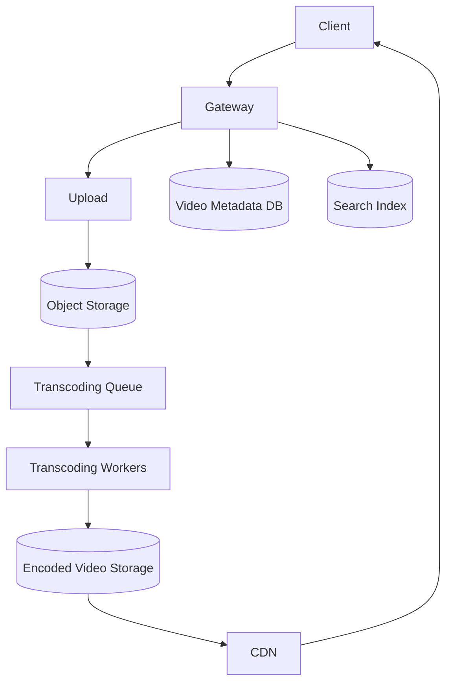

# Design YouTube

## Requirement Gathering
Clarify upload limits, supported formats, privacy options, live streaming scope, recommendation scope and target regions.

## Functional Requirements
- Upload videos and metadata.
- Transcode into multiple resolutions.
- Stream, pause, seek and resume.
- Like, comment, subscribe and report.
- Search videos and show view counts.

## Non-Functional Requirements
High availability, durable uploads, scalable media delivery, low startup latency, secure access and eventual consistency for view counters.

## Capacity Estimation
Assume 2 million video uploads/day and 100 million daily viewers. If each viewer watches 10 videos/day, there are about 1 billion playback sessions/day, or roughly 11,600 average sessions/second; peak may be 5x.

## Data Estimation
If each uploaded source video averages 100 MB, source storage is about 200 TB/day before transcoded copies. Store media in object storage with lifecycle policies. Metadata is small and belongs in a database.

## Network Estimation
At an average streaming bitrate of 2 Mbps, 10,000 concurrent viewers consume about 20 Gbps. A CDN is essential; origin servers should not serve every video segment.

## High-Level System Design

Upload directly to object storage using signed URLs. A queue triggers transcoding workers. Generate HLS/DASH segments and thumbnails, then publish only after validation. The player requests segments from the CDN.

## Data Model
`Video(video_id, owner_id, title, description, visibility, status, created_at)`; `VideoAsset(video_id, resolution, codec, storage_key, bitrate)`; `Comment(comment_id, video_id, user_id, text)`; `Subscription(user_id, channel_id)`; `ViewEvent(video_id, viewer_id, timestamp)`.

## API Endpoints
`POST /videos/upload-session`, `POST /videos/{id}/publish`, `GET /videos/{id}`, `GET /videos/{id}/manifest`, `POST /videos/{id}/comments`, `POST /videos/{id}/view-events`.

## Performance and Caching
Cache metadata and popular video manifests. Use CDN edge caching for immutable segments. Use asynchronous view aggregation instead of updating a counter on every play. Protect origins with signed URLs and origin shielding.

## Scaling
Scale API and transcoding workers horizontally. Use autoscaling based on queue depth. Separate storage, metadata and search scaling. Vertical scaling helps individual encoding workers temporarily, but horizontal workers provide throughput and fault isolation.

## Security
Authenticate uploaders, validate file types, scan content, enforce quotas and use signed upload/download URLs. Apply copyright/moderation workflows, encryption and authorization for private videos.

## Monitoring
Measure upload success, transcoding queue age, job failure rate, CDN cache hit ratio, playback startup time, rebuffering, origin bandwidth, HTTP errors and storage cost.

## Interview Follow-ups
- Why queue transcoding? It is slow and can be retried independently.
- How do you handle viral videos? CDN caching, origin shielding and prewarming.
- How do you resume uploads? Multipart upload with checkpoints.
