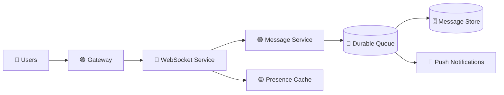

# 💬 WhatsApp System Design

> 📘 **Primary interview guide:** [Open the complete visual solution](03-WhatsApp/solution.md)

## 🎯 Core Topics
- WebSockets and connection routing
- Message ordering and delivery receipts
- Offline message storage
- Presence, retries, and idempotency
- Encryption, partitioning, scaling, and monitoring

See the detailed solution for complete flows, estimates, APIs, and trade-offs.