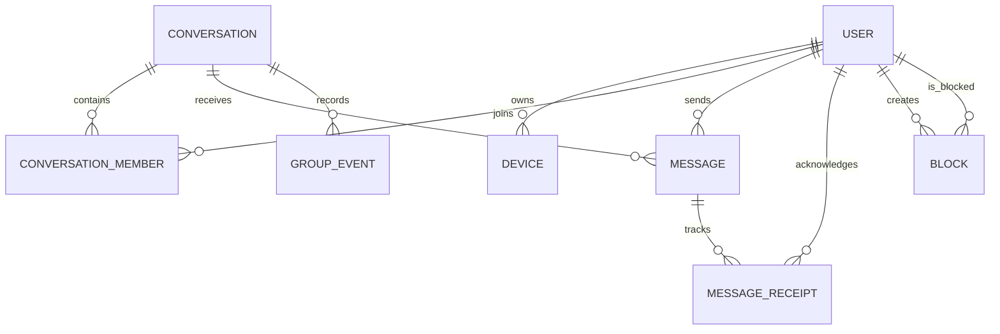

# WhatsApp-like Messaging — Detailed Data Model

## 1. ER Diagram

## 2. Core Entities

### USER

| Field | Type | Key | Description |
|---|---|---|---|
| user_id | UUID | PK | Account ID |
| phone_number | varchar(20) | UK | Verified phone number |
| display_name | varchar(120) | | Profile name |
| profile_photo_url | varchar(500) | | Blob/CDN URL |
| status_text | varchar(140) | | Optional status |
| account_status | varchar(30) | IDX | Active, blocked, deleted |
| created_at | timestamp | | Creation time |

### DEVICE

| Field | Type | Key | Description |
|---|---|---|---|
| device_id | UUID | PK | Device/session ID |
| user_id | UUID | FK/IDX | Owner |
| device_type | varchar(30) | | Android, iOS, web |
| push_token | varchar(500) | | Push notification token |
| last_seen_at | timestamp | IDX | Presence signal |
| encryption_identity_key | text | | Public identity key |
| status | varchar(20) | | Active or revoked |

### CONVERSATION

| Field | Type | Key | Description |
|---|---|---|---|
| conversation_id | UUID | PK | Chat ID |
| conversation_type | varchar(20) | IDX | Direct or group |
| title | varchar(255) | | Group title |
| created_by | UUID | FK | Creator |
| created_at | timestamp | | Creation time |
| last_message_at | timestamp | IDX | Sorting chats |

For direct chats, enforce a deterministic unique key based on the two user IDs, such as `min(userA,userB):max(userA,userB)`.

### CONVERSATION_MEMBER

| Field | Type | Key | Description |
|---|---|---|---|
| conversation_id | UUID | PK/FK | Chat ID |
| user_id | UUID | PK/FK | Member ID |
| role | varchar(20) | | Member, admin, owner |
| joined_at | timestamp | | Join time |
| left_at | timestamp | | Leave time, nullable |
| last_read_message_id | UUID | | Read cursor |
| muted_until | timestamp | | Notification mute setting |

**Indexes:** (user_id, last_message_at), conversation_id, active membership filter.

### MESSAGE

| Field | Type | Key | Description |
|---|---|---|---|
| message_id | UUID/ULID | PK | Globally unique ID |
| conversation_id | UUID | FK/PK component | Partition key |
| sender_id | UUID | FK/IDX | Sender |
| client_message_id | varchar(100) | UK per sender | Retry deduplication |
| message_type | varchar(30) | | Text, image, video, document, system |
| ciphertext | blob/text | | End-to-end encrypted payload |
| media_object_key | varchar(500) | | Blob object reference |
| sent_at | timestamp | CLUSTER/IDX | Server time |
| expires_at | timestamp | IDX | Disappearing message TTL |
| reply_to_message_id | UUID | FK | Reply reference |
| status | varchar(20) | | Accepted, deleted, expired |

**Partitioning:** partition by `conversation_id`; cluster/sort by monotonically increasing message sequence or server timestamp. Avoid relying only on timestamps for ordering.

### MESSAGE_RECEIPT

| Field | Type | Key | Description |
|---|---|---|---|
| message_id | UUID | PK/FK | Message |
| user_id | UUID | PK/FK | Recipient |
| delivered_at | timestamp | | Delivery time |
| read_at | timestamp | | Read time |
| played_at | timestamp | | Audio/video played time |

For large groups, store compact per-user read cursors rather than creating excessive receipt rows for every message.

### GROUP_EVENT

| Field | Type | Key | Description |
|---|---|---|---|
| event_id | UUID | PK | Event ID |
| conversation_id | UUID | FK/IDX | Group chat |
| actor_user_id | UUID | FK | User performing action |
| event_type | varchar(40) | | Member added, removed, title changed |
| target_user_id | UUID | FK | Affected user, nullable |
| event_payload | jsonb | | Additional details |
| created_at | timestamp | | Event time |

### BLOCK

| Field | Type | Key | Description |
|---|---|---|---|
| blocker_user_id | UUID | PK/FK | User who blocks |
| blocked_user_id | UUID | PK/FK | Blocked account |
| created_at | timestamp | | Block time |

## 3. Storage Responsibility

| Data | Recommended store | Reason |
|---|---|---|
| Message timeline | Cassandra/Scylla/Cosmos DB | High write volume and conversation partitioning |
| User/profile data | SQL/Cosmos DB | Account and profile queries |
| Presence | Redis | Fast expiring state |
| Media | Azure Blob Storage | Large encrypted objects |
| Push jobs | Service Bus/Kafka | Durable asynchronous delivery |
| Search metadata | Optional dedicated index | Search only permitted metadata, not plaintext E2EE content |
| Key material metadata | Secure key service + encrypted database | Key protection and rotation |

## 4. Consistency and Reliability

- Use client-generated IDs plus `(sender_id, client_message_id)` for idempotent retries.
- Persist the message before acknowledging acceptance to the sender.
- Use an outbox or durable delivery queue for fan-out and push notifications.
- Use per-conversation sequence numbers to maintain ordering.
- Treat online presence and delivery indicators as eventually consistent.
- Do not store plaintext message content on the server in an end-to-end encrypted design.
- Apply retention, deletion, abuse reporting, and legal hold rules without exposing message plaintext where encryption prevents access.
