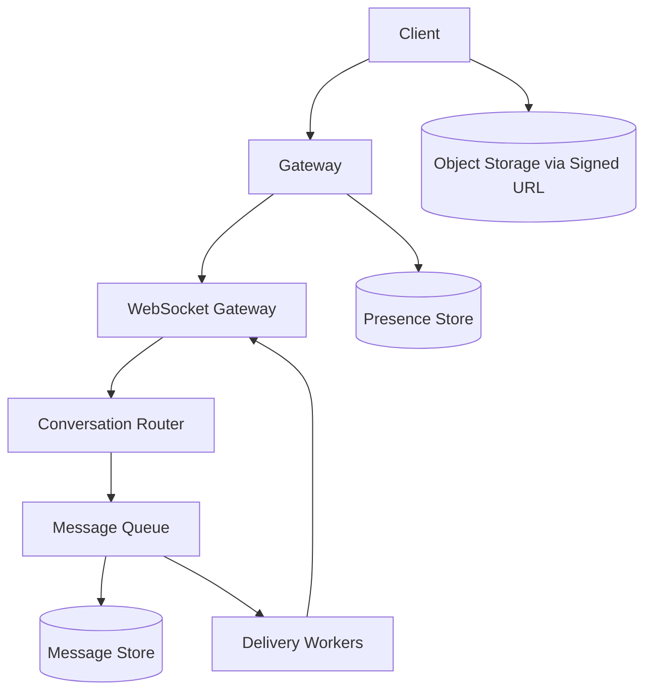

# Design WhatsApp

## Requirement Gathering
Clarify one-to-one vs group chat, message size, voice/video calling, delivery guarantees, multi-device support, search and retention.

## Functional Requirements
- Register users and manage contacts.
- Send text, images and files.
- Show sent, delivered and read states.
- Support online presence, typing status and offline delivery.
- Support groups and message history.

## Non-Functional Requirements
Low message latency, high availability, ordered messages per conversation, privacy, durable accepted messages and horizontal scalability.

## Capacity Estimation
Assume 500 million daily active users and 50 messages/user/day: 25 billion messages/day, about 290,000 average messages/second. Peak can be several times higher. Media is stored separately from message metadata.

## Data Estimation
At 300 bytes average message metadata, 25 billion messages require about 7.5 TB/day before indexes, replicas and attachments. Use retention policies and tiered storage.

## Network Estimation
If 20% of messages include a 200 KB attachment, media traffic is large and should use object storage plus CDN. Text traffic is handled by persistent connections and compact payloads.

## High-Level System Design

Clients maintain WebSocket connections. The router assigns conversations to partitions. Persist a message before acknowledging it as accepted. Delivery workers push to online devices or keep it pending for offline devices.

## Data Model
`User(user_id, phone_hash, profile)`; `Conversation(conversation_id, type)`; `Member(conversation_id, user_id, role)`; `Message(message_id, conversation_id, sender_id, sequence, body_ref, created_at)`; `Receipt(message_id, device_id, state, timestamp)`; `Device(user_id, device_id, push_token)`.

## API Endpoints
`POST /conversations`, `GET /conversations`, `POST /messages`, `GET /conversations/{id}/messages?cursor=`, `POST /messages/{id}/receipt`, `GET /presence/{userId}`, `POST /media/upload-session`.

## Performance and Caching
Use Redis for presence and short-lived connection metadata. Do not use cache as the source of truth for messages. Batch acknowledgements and use cursor pagination. Apply backpressure when a user's devices are slow.

## Scaling
WebSocket gateways scale horizontally with connection-aware routing. Partition messages by conversation ID. Use replicas for history reads and a durable queue for delivery. Vertical scaling can increase connection capacity per node, but horizontal scaling improves availability.

## Security
Use end-to-end encryption for message content where required, secure key management, TLS, device verification, abuse controls and privacy-preserving logs. Authorization must be checked for every conversation access.

## Monitoring
Monitor active connections, reconnect rate, send-to-deliver latency, queue lag, dropped connections, message persistence errors, offline backlog and push notification failures.

## Interview Follow-ups
- How do you preserve order? Assign monotonically increasing sequence numbers per conversation partition.
- What if a client reconnects? Resume from the last acknowledged sequence.
- How do you avoid duplicate messages? Client message IDs plus idempotent writes.
