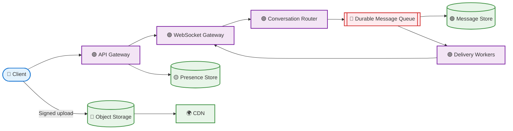
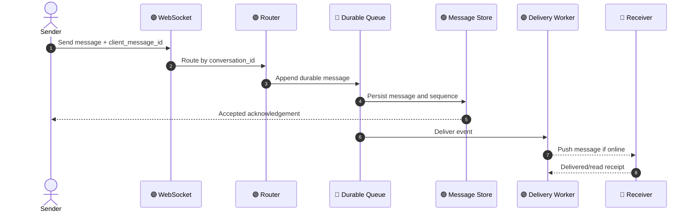
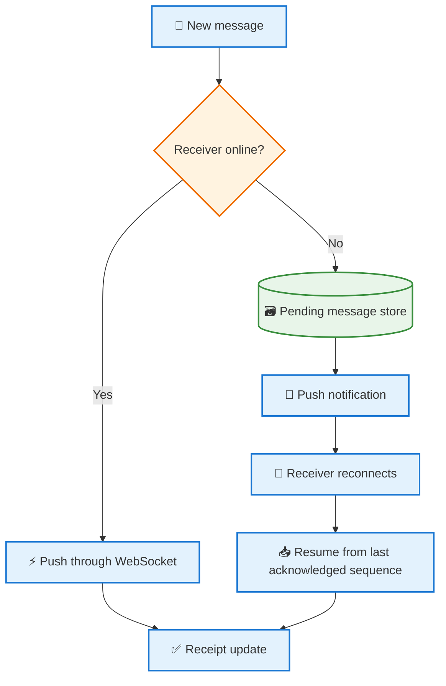

# 💬 **WhatsApp-Like Messaging System Design**

> 🎯 **Mission:** Deliver messages quickly, preserve conversation order, and never lose an accepted message.

> 🎨 **Visual legend:** 🔵 Client · 🟣 Gateway/compute · 🟢 Storage · 🔴 Async delivery · 🟡 Presence

## 🟣 1. 🧭 Requirement Gathering — *Understand the conversation*

Clarify one-to-one vs group chat, message size, voice/video calling, delivery guarantees, multi-device support, search and retention.

💡 **User journey:** `✍️ Compose → 📤 Send → 💾 Persist → 📬 Deliver → ✅ Read`

## 🔵 2. ⚙️ Functional Requirements

- Register users and manage contacts.
- Send text, images and files.
- Show sent, delivered and read states.
- Support online presence, typing status and offline delivery.
- Support groups and message history.

## 🟢 3. 🛡️ Non-Functional Requirements

Low message latency, high availability, ordered messages per conversation, privacy, durable accepted messages and horizontal scalability.

## 🟠 4. 📊 Capacity Estimation

Assume 500 million daily active users and 50 messages/user/day: 25 billion messages/day, about 290,000 average messages/second. Peak can be several times higher. Media is stored separately from message metadata.

## 🟡 5. 💾 Data and Network Estimation

At 300 bytes average message metadata, 25 billion messages require about 7.5 TB/day before indexes, replicas and attachments. Use retention policies and tiered storage.

If 20% of messages include a 200 KB attachment, media traffic is large and should use object storage plus CDN. Text traffic is handled by persistent connections and compact payloads.

## 🌈 6. 🏗️ High-Level System Design — *A message travels through a reliable pipeline*

Clients maintain WebSocket connections. The router assigns conversations to partitions. Persist a message before acknowledging it as accepted. Delivery workers push to online devices or keep it pending for offline devices.

### 🎬 Send-message sequence

### 🔁 Offline delivery flow

## 🔵 7. 🗂️ Data Model

`User(user_id, phone_hash, profile)`; `Conversation(conversation_id, type)`; `Member(conversation_id, user_id, role)`; `Message(message_id, conversation_id, sender_id, sequence, body_ref, created_at)`; `Receipt(message_id, device_id, state, timestamp)`; `Device(user_id, device_id, push_token)`.

## 🟣 8. 🔌 API Endpoints

- `POST /conversations`
- `GET /conversations`
- `POST /messages`
- `GET /conversations/{id}/messages?cursor=`
- `POST /messages/{id}/receipt`
- `GET /presence/{userId}`
- `POST /media/upload-session`

## 🟢 9. 🚀 Performance and Caching

Use Redis for presence and short-lived connection metadata. Do not use cache as the source of truth for messages. Batch acknowledgements and use cursor pagination. Apply backpressure when a user's devices are slow.

## 🟠 10. 📈 Scaling

WebSocket gateways scale horizontally with connection-aware routing. Partition messages by conversation ID. Use replicas for history reads and a durable queue for delivery. Vertical scaling can increase connection capacity per node, but horizontal scaling improves availability.

## 🔐 11. Security

Use end-to-end encryption for message content where required, secure key management, TLS, device verification, abuse controls and privacy-preserving logs. Authorization must be checked for every conversation access.

## 🔭 12. Monitoring and Observability

Monitor active connections, reconnect rate, send-to-deliver latency, queue lag, dropped connections, message persistence errors, offline backlog and push notification failures.

## 🎤 13. Interview Follow-ups

- **How do you preserve order?** Assign monotonically increasing sequence numbers per conversation partition.
- **What if a client reconnects?** Resume from the last acknowledged sequence.
- **How do you avoid duplicate messages?** Client message IDs plus idempotent writes.

> ⭐ **Remember:** A WebSocket provides speed, but the durable queue and message store provide reliability. Never treat an in-memory connection as the source of truth.
