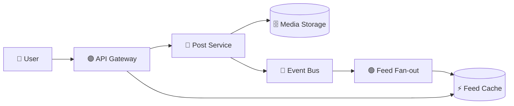

# 📸 Facebook / Instagram System Design

> 📘 **Primary interview guide:** [Open the complete visual solution](04-Facebook-Instagram/solution.md)

## 🎯 Core Topics
- Feed generation and ranking
- Fan-out on write vs. read
- Celebrity and hot-key protection
- Media storage and CDN
- Caching, consistency, privacy, and observability

The detailed solution covers architecture, sequence flows, scaling strategies, and interview follow-ups.