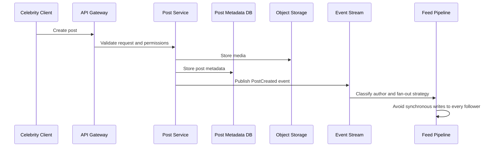
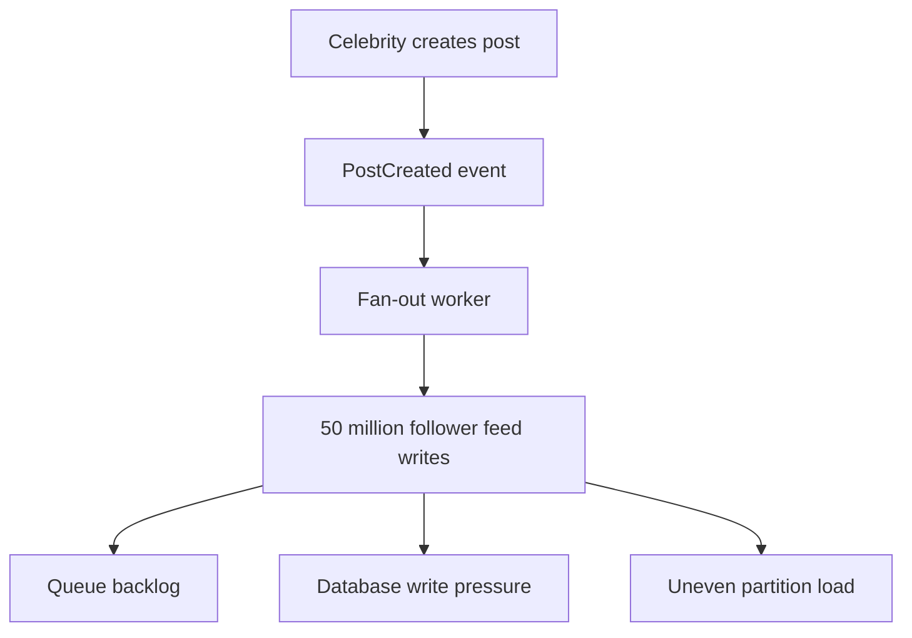
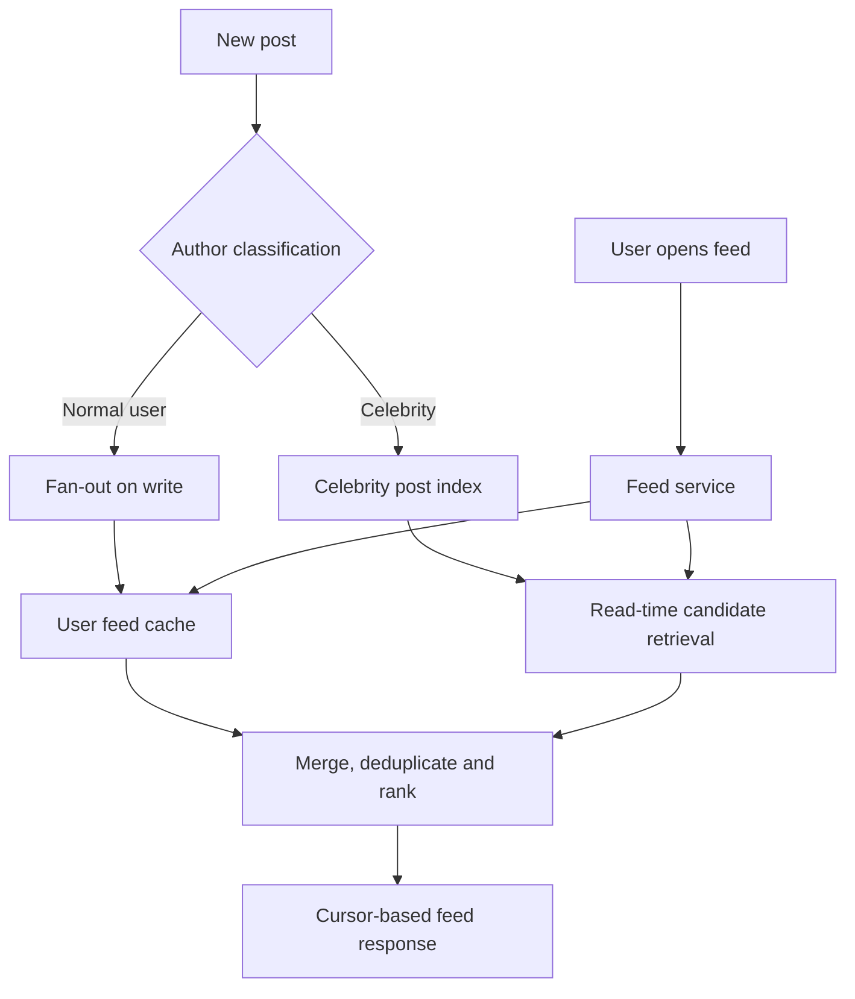
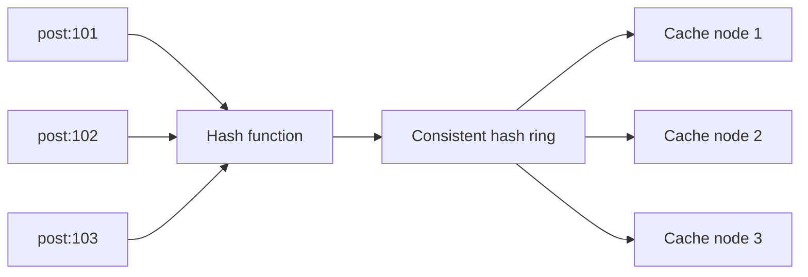
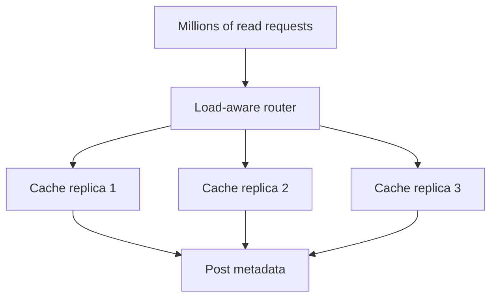
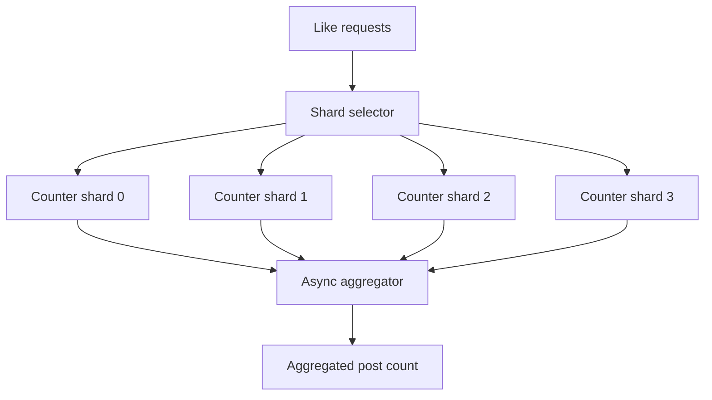

# Celebrity Problem in Social Media Systems

## 1. What Is the Celebrity Problem?

The **celebrity problem** occurs when a user has millions of followers and publishes content that must be delivered to a very large audience.

Example:

- A celebrity has 50 million followers.
- The celebrity publishes one post.
- A pure fan-out-on-write design may attempt up to 50 million feed writes.
- If several high-follower accounts publish at the same time, feed databases, queues, caches and workers may become overloaded.
- If the post becomes viral, millions of users may read the same post, comments and engagement counters at almost the same time.

This problem is also called:

- Celebrity fan-out problem
- Hot-user problem
- Hot-key problem, when one post or counter receives disproportionate traffic

## 2. What Happens When a Celebrity Publishes a Post?



The normal publication workflow should be asynchronous:

1. Validate the request and the author's permissions.
2. Upload media to object storage.
3. Store post metadata in the post database.
4. Publish a `PostCreated` event to a queue or event stream.
5. Classify the author based on follower count, activity and traffic patterns.
6. Use fan-out-on-write for normal users.
7. Use fan-out-on-read for celebrities and other hot accounts.

## 3. Why Pure Fan-Out-on-Write Fails



Pure fan-out-on-write has several problems:

- Large write amplification.
- Queue backlog during traffic spikes.
- Increased database write cost.
- Hot partitions for popular users or follower groups.
- Work is performed for followers who may never open their feed.
- A single celebrity post can compete with normal user traffic.

## 4. Recommended Design: Hybrid Fan-Out

Use a different strategy depending on the author:

| Account type | Strategy | Reason |
|---|---|---|
| Normal user | Fan-out-on-write | Keeps feed reads fast and write volume manageable |
| Large creator | Adaptive or partial fan-out | Balances write cost and read latency |
| Celebrity account | Fan-out-on-read | Avoids millions of feed writes |
| Viral post | Dedicated hot-content path | Isolates high read and engagement traffic |



### Fan-out-on-write

The post is written into follower feed stores when it is published.

**Advantages**

- Fast feed reads.
- Simple ranking input for normal accounts.

**Disadvantages**

- High write amplification.
- Expensive for users with millions of followers.

### Fan-out-on-read

The post is stored once in a post store or celebrity-post index. When a follower opens the feed, the feed service retrieves relevant celebrity posts and merges them with normal feed entries.

**Advantages**

- Avoids millions of writes.
- Better protection against celebrity traffic.

**Disadvantages**

- More work during feed reads.
- Ranking and deduplication become more complex.
- Requires efficient indexes and caching.

## 5. Celebrity Post Read Flow

1. Store the post metadata in the post database.
2. Store media in object storage.
3. Publish a post event.
4. Add the post to a celebrity-post index.
5. Do not synchronously create a feed row for every follower.
6. When a follower opens the feed, retrieve normal feed entries.
7. Retrieve recent celebrity posts relevant to the follower.
8. Apply privacy, blocking and eligibility checks.
9. Merge, deduplicate and rank candidates.
10. Return results using cursor-based pagination.

## 6. Problems Caused by a Viral Post

| Problem | Explanation | Mitigation |
|---|---|---|
| Post metadata hotspot | Millions of requests read the same post record | Replicated read cache and request coalescing |
| Media traffic spike | Many users request the same image or video | CDN and multiple media renditions |
| Like counter contention | Many users update one counter row | Sharded counters and asynchronous aggregation |
| Comment hotspot | Large numbers of comments target one post | Partition by post and time bucket; cursor pagination |
| Ranking overload | Feed ranking receives too many identical candidates | Cache ranked candidates and use graceful degradation |
| Notification backlog | Notifications are generated for a large audience | Batch, prioritize and rate-limit notifications |
| Cache stampede | Many requests miss the same expired key | Single-flight, TTL jitter and stale-while-revalidate |
| Abuse and bots | Automated traffic multiplies load | Per-user, IP and device limits plus bot detection |

## 7. Consistent Hashing: What It Solves

**Consistent hashing** distributes keys across nodes while minimizing key movement when nodes are added or removed.

Without consistent hashing, adding one cache node may require remapping a large portion of keys. With consistent hashing, most keys remain assigned to the same node and only a smaller portion moves.



### Benefits

- More stable key-to-node mapping.
- Reduced cache movement during scaling.
- Better horizontal scalability.
- Useful for distributed caches and partitioned data stores.

### Important limitation

Consistent hashing **does not automatically solve a hot key**.

If millions of users request `post:12345`, the hash of that key may still map to one cache node. That node can become overloaded even though the overall cluster has many nodes.

Therefore:

> Consistent hashing solves distribution and remapping efficiency. It does not, by itself, split traffic for one extremely popular key.

## 8. Consistent Hashing Combined With Hot-Key Replication

For a viral public post, replicate the same metadata across multiple cache nodes or use a replica-aware cache layer.

```text
post:12345:replica:0
post:12345:replica:1
post:12345:replica:2
post:12345:replica:3
```

The read service can select a replica using a request hash, load-aware routing or round-robin selection.



### Trade-offs

- More cache memory is required.
- Cache invalidation becomes more complex.
- Replicas may briefly contain different versions.
- Best suited to public or mostly immutable post metadata.

For private posts, authorization must be checked separately. Do not use a shared public cache key that could expose private content.

## 9. Key Sharding for Hot Objects

Instead of using one key, split requests across multiple logical keys:

```text
post:12345:shard:0
post:12345:shard:1
post:12345:shard:2
post:12345:shard:3
```

A request can select a shard based on user ID, request ID or another stable routing value.

Key sharding is useful when:

- One key receives excessive traffic.
- The cache system supports independent copies.
- The application can tolerate replicated values.

For immutable post content, all shards can point to the same object-storage URL or media manifest. For mutable metadata, use versioning and controlled invalidation.

## 10. Sharded Counters for Likes and Comments

Do not update one database row for every like on a viral post.

Instead, distribute writes across counter shards:

```text
counter_shard = hash(user_id) % N
```

Example:

```text
post:12345:counter:0
post:12345:counter:1
post:12345:counter:2
post:12345:counter:3
```

Each shard stores a partial count. A background aggregator combines the shards and publishes a total.



The UI can display an eventually consistent count. The system should still enforce idempotency, usually through a unique constraint or deduplication key such as `(user_id, post_id)`.

## 11. Complete Mitigation Strategy

For a celebrity or viral post, combine multiple techniques:

1. Hybrid fan-out: fan-out-on-read for celebrities.
2. CDN delivery for public media.
3. Replicated caches for hot metadata.
4. Request coalescing to prevent duplicate origin requests.
5. Consistent hashing for stable distribution of normal keys.
6. Hot-key replication or key sharding for viral objects.
7. Sharded counters for likes and comments.
8. Asynchronous event processing for analytics and notifications.
9. Priority queues for critical work.
10. Backpressure and autoscaling for workers.
11. Rate limiting and bot protection.
12. Graceful degradation, such as delayed counts or simplified ranking.

## 12. Comparison of Techniques

| Technique | Primary purpose | Does it solve a hot celebrity post alone? |
|---|---|---|
| Consistent hashing | Stable distribution of keys | No |
| Cache replication | Spread reads for the same object | Partially |
| Key sharding | Split traffic for a hot object | Partially |
| Sharded counters | Split high-volume engagement writes | For counter contention |
| Fan-out-on-read | Avoid millions of feed writes | For celebrity feed generation |
| CDN | Offload media delivery | For media traffic |
| Request coalescing | Prevent duplicate origin work | For cache misses |
| Rate limiting | Protect system from abusive traffic | For uncontrolled clients |

## 13. Monitoring Metrics

Track both general and celebrity-specific metrics:

- Feed read latency: p50, p95 and p99.
- Celebrity-post read QPS.
- Hot-key request rate.
- Cache hit ratio by key class.
- Cache replica load distribution.
- Counter-shard skew.
- Fan-out queue backlog and processing delay.
- Ranking service latency and fallback rate.
- CDN hit ratio and origin bandwidth.
- Comment creation rate.
- Notification queue delay.
- Rate-limit rejection rate.
- Duplicate event and idempotency failures.

## 14. Interview-Ready Answer

> The celebrity problem occurs when a user with millions of followers publishes a post. Pure fan-out-on-write may create millions of feed writes and overload queues and databases. I would use a hybrid architecture: fan-out-on-write for normal users and fan-out-on-read for celebrities. Celebrity posts would be stored in a dedicated index and merged into followers' feeds during reads. For viral content, I would use CDN delivery, replicated caches, request coalescing, sharded engagement counters, asynchronous processing, rate limiting and graceful degradation. Consistent hashing helps distribute keys and reduce remapping when nodes change, but it does not solve a single hot key. Therefore, I would combine it with hot-key replication or key sharding. Consistent hashing improves scalability, while the complete design requires multiple techniques to control celebrity traffic.
