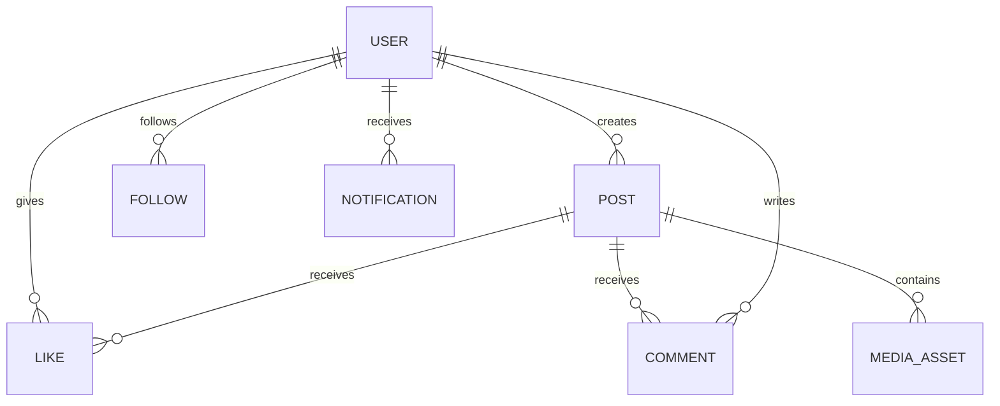

# Facebook/Instagram-like Social Platform — Detailed Data Model

## ER Diagram

## USER
| Field | Type | Key | Description |
|---|---|---|---|
| user_id | UUID | PK | User ID |
| username | varchar(50) | UK | Public handle |
| email | varchar(320) | UK | Login email |
| profile_json | jsonb | | Profile attributes |
| privacy_level | varchar(20) | | Public or private |
| status | varchar(20) | IDX | Active, suspended, deleted |
| created_at | timestamp | | Creation time |

## POST
| Field | Type | Key | Description |
|---|---|---|---|
| post_id | UUID/ULID | PK | Post ID |
| author_id | UUID | FK/IDX | Creator |
| caption | text | | Caption |
| visibility | varchar(20) | IDX | Public, followers, private |
| created_at | timestamp | IDX | Creation time |
| status | varchar(20) | IDX | Active, hidden, deleted |

## FOLLOW
| Field | Type | Key | Description |
|---|---|---|---|
| follower_id | UUID | PK/FK | Source user |
| followed_id | UUID | PK/FK | Target user |
| status | varchar(20) | IDX | Pending, active, blocked |
| created_at | timestamp | | Follow time |

Indexes: `(follower_id, created_at)`, `(followed_id, created_at)`. Enforce no self-follow and unique pair.

## LIKE / COMMENT
| Entity | Field | Type | Key |
|---|---|---|---|
| LIKE | user_id | UUID | PK/FK |
| LIKE | post_id | UUID | PK/FK |
| LIKE | created_at | timestamp | |
| COMMENT | comment_id | UUID | PK |
| COMMENT | post_id | UUID | FK/IDX |
| COMMENT | author_id | UUID | FK/IDX |
| COMMENT | parent_comment_id | UUID | FK |
| COMMENT | body | text | |
| COMMENT | created_at | timestamp | |

## MEDIA_ASSET
| Field | Type | Key | Description |
|---|---|---|---|
| asset_id | UUID | PK | Media ID |
| post_id | UUID | FK/IDX | Parent post |
| object_key | varchar(500) | | Blob location |
| media_type | varchar(30) | | Image, video, audio |
| width | int | | Pixel width |
| height | int | | Pixel height |
| processing_status | varchar(30) | IDX | Pending, ready, failed |

## Storage and Design
- Store posts and relationships in SQL/Cosmos DB depending on access patterns.
- Store images/videos in Blob Storage and deliver through CDN.
- Maintain feed fan-out asynchronously using Kafka/Event Hubs and materialized feed stores.
- Use Redis for hot profiles, counters, and feed pages.
- Keep likes idempotent with a unique `(user_id, post_id)` key.
- Apply privacy checks at read time and avoid exposing private-account content through caches.
