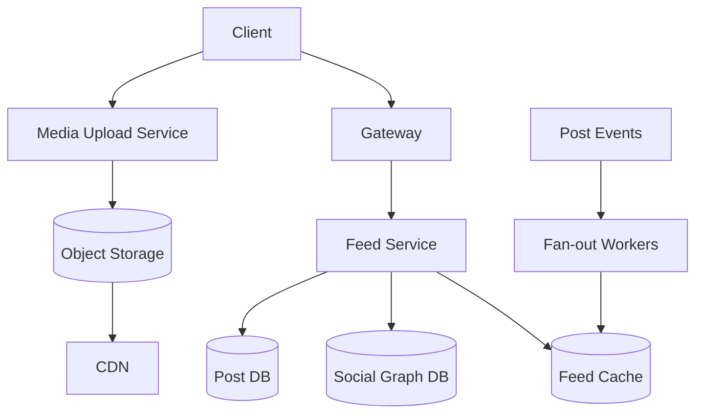
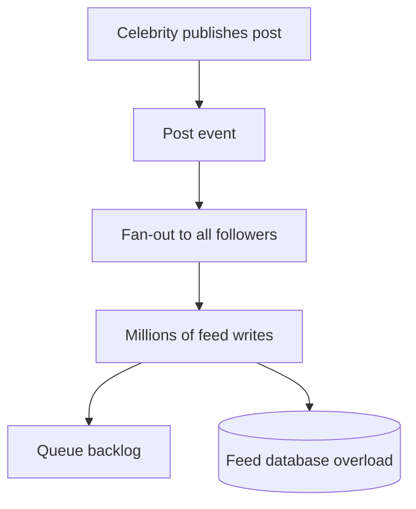
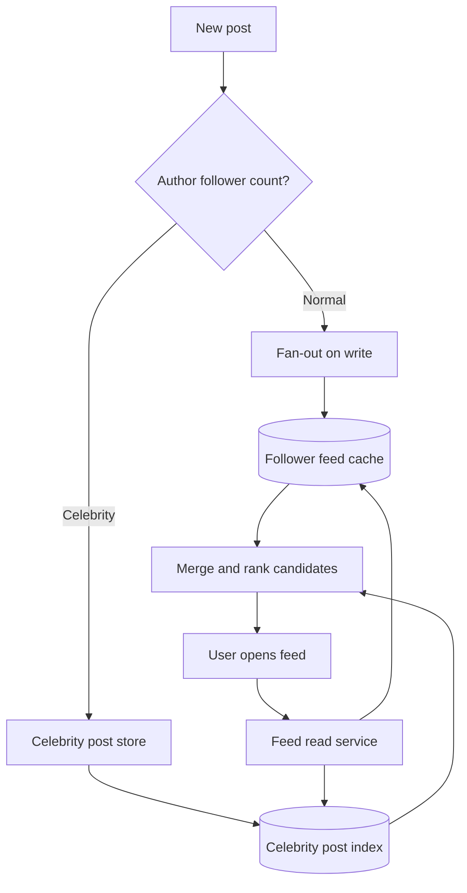

# Design Facebook / Instagram

## Requirement Gathering
Clarify whether the scope includes profiles, follow/friend relationships, photo/video upload, feed ranking, stories, comments, notifications and search.

## Functional Requirements
- Create profiles and follow/friend users.
- Upload photos/videos with privacy controls.
- Generate a personalized feed.
- Like, comment, share and notify users.
- Support pagination and content reporting.

## Non-Functional Requirements
High availability, fast feed reads, scalable media delivery, privacy, eventual consistency for likes and feed ranking, and graceful degradation.

## Capacity Estimation
Assume 300 million daily active users and 20 feed opens/user/day: 6 billion feed requests/day, around 69,000 average requests/second; peak may be 5x. Assume 20 million media uploads/day.

## Data Estimation
If each media object averages 2 MB, uploads create about 40 TB/day. Use object storage and CDN. Store only metadata and references in the database.

## Network Estimation
Feed responses should contain metadata and small thumbnails; full media comes from a CDN. Compress JSON and use adaptive image/video sizes.

## High-Level System Design

Use hybrid feed generation: fan-out on write for normal users and fan-out on read for celebrities with very large follower counts. Merge and rank candidates at read time.

## Celebrity Problem (Hot Users / Viral Content)

### What is the celebrity problem?
A celebrity or highly followed account may have millions of followers. When that account publishes one post, sending the post separately to every follower can create a huge fan-out workload. For example:

- One celebrity has 50 million followers.
- A single post creates up to 50 million feed-write operations.
- Several celebrities posting at the same time can overload feed databases, queues and caches.
- A viral post can also create a read hotspot because millions of users request the same post, comments and like counters simultaneously.

This is also called the **hot-key problem** or **celebrity fan-out problem**.

### Why pure fan-out on write fails


With pure fan-out on write, the system spends significant resources creating feed entries that many users may never read. A large follower count also causes queue delays and uneven partition load.

### Recommended solution: Hybrid fan-out
Use different strategies based on the author's follower count and activity:

| Account type | Strategy | Reason |
|---|---|---|
| Normal user | Fan-out on write | Followers are limited and feed reads are fast |
| Large creator | Fan-out on read | Avoid millions of feed writes per post |
| Celebrity / hot account | Store in a celebrity-post index and merge during reads | Prevent hot partitions and write amplification |
| Viral post | CDN + replicated cache + asynchronous counters | Absorb high read traffic |



### Celebrity post read flow
1. The celebrity publishes a post.
2. Store post metadata in the post database and media in object storage.
3. Publish an event to a queue or event stream.
4. Do not synchronously write the post into every follower's feed.
5. Maintain a small, highly available celebrity-post index.
6. When a follower opens the feed, retrieve normal feed entries and recent celebrity posts.
7. Merge, deduplicate and rank both candidate sets.
8. Return the page using cursor-based pagination.

### Handling viral read traffic

| Problem | Mitigation |
|---|---|
| Same post requested by millions of users | CDN and multi-region edge caching |
| Hot metadata key | Replicated read cache and request coalescing |
| Like/comment counter contention | Sharded counters with asynchronous aggregation |
| Comment overload | Partition comments by `post_id` and time bucket; paginate with cursors |
| Feed ranking overload | Cache ranked candidates for short periods and degrade gracefully |
| Queue backlog | Priority queues, autoscaling workers and backpressure |
| Cache stampede | TTL jitter, single-flight/request coalescing and stale-while-revalidate |
| Abuse or bot traffic | Per-user, IP and device rate limits; bot detection |

### Sharded counters
Do not update one counter row for every like on a viral post. Instead, distribute writes across shards:

```text
counter_shard = hash(user_id) % N
```

Each shard maintains a partial count. A background aggregator periodically combines the shards and publishes an approximate or eventually consistent total. The user interface can display a slightly delayed count while the source of truth remains durable.

### Cache design
- Cache post metadata separately from user-specific permissions.
- Cache public media using a CDN.
- Use replicated cache keys such as `post:{post_id}:metadata:{shard}` when necessary.
- Never cache private content without including the correct authorization context.
- Use short TTLs for engagement counts and longer TTLs for immutable media.
- Invalidate or version cache entries when a post is deleted, restricted or reported.

### Trade-offs

| Decision | Benefit | Cost |
|---|---|---|
| Fan-out on read for celebrities | Avoids huge write amplification | Adds work during feed reads |
| Asynchronous counters | Handles high write volume | Counts are eventually consistent |
| CDN caching | Reduces origin traffic and latency | Cache invalidation is required |
| Approximate ranking/counters during overload | Keeps the service available | User-visible data may be delayed or less precise |
| Separate celebrity path | Isolates hot traffic | Increases system complexity |

### Interview answer
> I would not use pure fan-out on write for celebrities. I would use a hybrid feed architecture: fan-out on write for normal accounts, and fan-out on read for high-follower accounts. Celebrity posts would be stored in a dedicated index and merged into the follower's feed at read time. For viral content, I would use CDN caching, replicated metadata caches, request coalescing, sharded engagement counters, asynchronous processing and rate limiting. This prevents one celebrity post from overwhelming the feed database while keeping feed latency predictable.

## Data Model
`User(user_id, profile)`; `Follow(follower_id, followee_id, created_at)`; `Post(post_id, author_id, media_ref, visibility, created_at)`; `FeedEntry(user_id, post_id, score, created_at)`; `Like(user_id, post_id)`; `Comment(comment_id, post_id, user_id, body)`.

For celebrity support, add or maintain:
- `CelebrityProfile(user_id, follower_count, fanout_mode, updated_at)`
- `CelebrityPostIndex(author_id, post_id, created_at, ranking_score)`
- `CounterShard(entity_id, shard_id, like_count, comment_count)`

## API Endpoints
`GET /feed?cursor=`, `POST /posts`, `GET /posts/{id}`, `POST /posts/{id}/likes`, `POST /posts/{id}/comments`, `POST /users/{id}/follow`, `POST /media/upload-session`.

## Performance and Caching
Cache feed pages, profiles and popular posts. Use cursor pagination rather than deep offsets. Cache immutable media through a CDN. Batch fan-out and protect against celebrity hot spots. Use request coalescing and sharded counters for viral posts.

## Scaling
Scale feed readers, ranking workers and media delivery separately. Partition posts by author or time. Use queues for fan-out, notifications and analytics. Horizontal scaling is the primary approach; vertical scaling helps individual database nodes but does not remove single-node limits.

## Security
Enforce privacy on every read, protect media with signed URLs, use OAuth2/OIDC, rate limit interactions, detect abuse and encrypt sensitive data. Do not expose private post metadata through caches.

## Monitoring
Track feed latency, cache hit rate, fan-out queue lag, ranking errors, media upload success, CDN hit ratio, notification delay and abuse detection outcomes. Add celebrity-specific metrics such as hot-key rate, celebrity-post read QPS, fan-out suppression rate, counter-shard skew and queue backlog.

## Interview Follow-ups
- Fan-out on write vs read? Use a hybrid model because celebrity accounts create huge write amplification.
- How do you prevent duplicate likes? Unique constraint on `(user_id, post_id)`.
- How do you handle a viral post? CDN, cache replication, request coalescing and asynchronous counters.
- How do you isolate celebrity traffic? Dedicated read paths, cache namespaces, separate queues and autoscaling policies.
- What happens if ranking is unavailable? Return chronologically ordered candidates from cached and recent sources as a graceful fallback.
