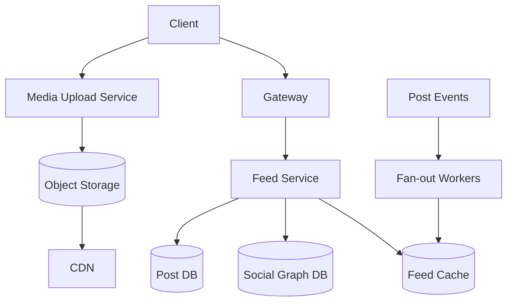

# Design Facebook / Instagram

## Requirement Gathering
Clarify whether the scope includes profiles, follow/friend relationships, photo/video upload, feed ranking, stories, comments, notifications and search.

## Functional Requirements
- Create profiles and follow/friend users.
- Upload photos/videos with privacy controls.
- Generate a personalized feed.
- Like, comment, share and notify users.
- Support pagination and content reporting.

## Non-Functional Requirements
High availability, fast feed reads, scalable media delivery, privacy, eventual consistency for likes and feed ranking, and graceful degradation.

## Capacity Estimation
Assume 300 million daily active users and 20 feed opens/user/day: 6 billion feed requests/day, around 69,000 average requests/second; peak may be 5x. Assume 20 million media uploads/day.

## Data Estimation
If each media object averages 2 MB, uploads create about 40 TB/day. Use object storage and CDN. Store only metadata and references in the database.

## Network Estimation
Feed responses should contain metadata and small thumbnails; full media comes from a CDN. Compress JSON and use adaptive image/video sizes.

## High-Level System Design

Use hybrid feed generation: fan-out on write for normal users and fan-out on read for celebrities with very large follower counts. Merge and rank candidates at read time.

## Data Model
`User(user_id, profile)`; `Follow(follower_id, followee_id, created_at)`; `Post(post_id, author_id, media_ref, visibility, created_at)`; `FeedEntry(user_id, post_id, score, created_at)`; `Like(user_id, post_id)`; `Comment(comment_id, post_id, user_id, body)`.

## API Endpoints
`GET /feed?cursor=`, `POST /posts`, `GET /posts/{id}`, `POST /posts/{id}/likes`, `POST /posts/{id}/comments`, `POST /users/{id}/follow`, `POST /media/upload-session`.

## Performance and Caching
Cache feed pages, profiles and popular posts. Use cursor pagination rather than deep offsets. Cache immutable media through a CDN. Batch fan-out and protect against celebrity hot spots.

## Scaling
Scale feed readers, ranking workers and media delivery separately. Partition posts by author or time. Use queues for fan-out, notifications and analytics. Horizontal scaling is the primary approach; vertical scaling helps individual database nodes but does not remove single-node limits.

## Security
Enforce privacy on every read, protect media with signed URLs, use OAuth2/OIDC, rate limit interactions, detect abuse and encrypt sensitive data. Do not expose private post metadata through caches.

## Monitoring
Track feed latency, cache hit rate, fan-out queue lag, ranking errors, media upload success, CDN hit ratio, notification delay and abuse detection outcomes.

## Interview Follow-ups
- Fan-out on write vs read? Use a hybrid model because celebrity accounts create huge write amplification.
- How do you prevent duplicate likes? Unique constraint on `(user_id, post_id)`.
- How do you handle a viral post? CDN, cache replication, request coalescing and asynchronous counters.
