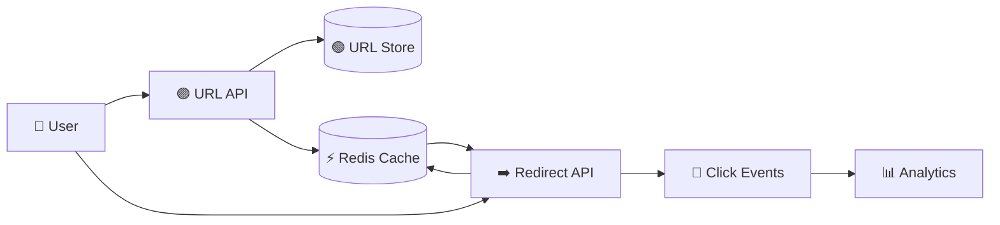

# 🔗 URL Shortener System Design

> 📘 **Primary interview guide:** [Open the complete visual solution](05-URL-Shortener/solution.md)

## 🎯 Core Topics
- Base62 or distributed ID generation
- Redirect latency and caching
- Collision prevention and custom aliases
- Analytics event streaming
- Abuse prevention, expiration, and availability

The detailed solution includes data model, APIs, capacity estimates, scaling, security, and observability.