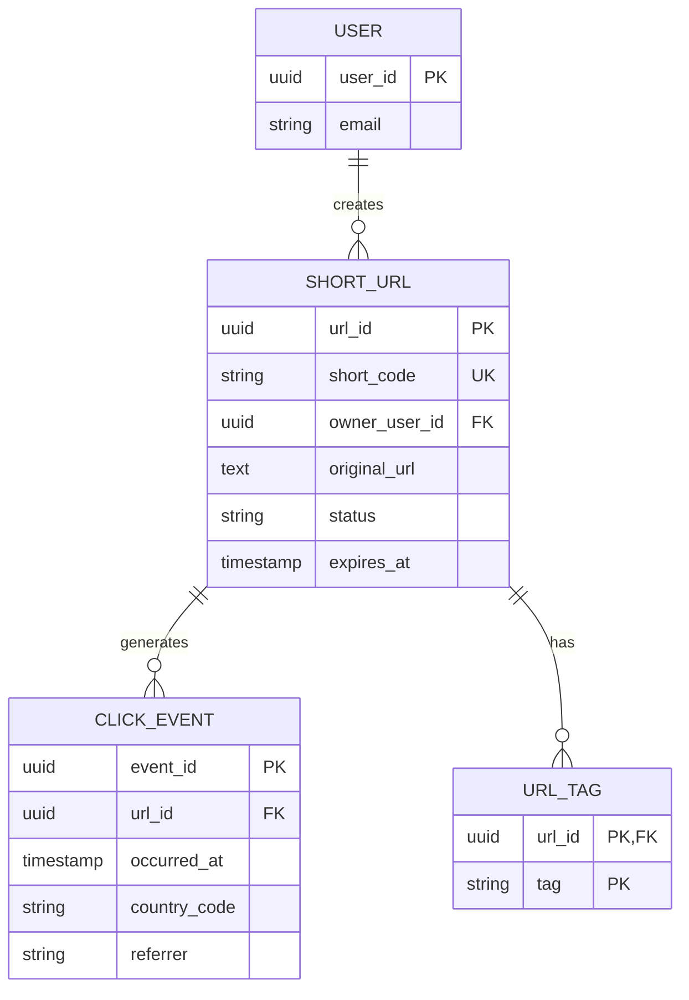
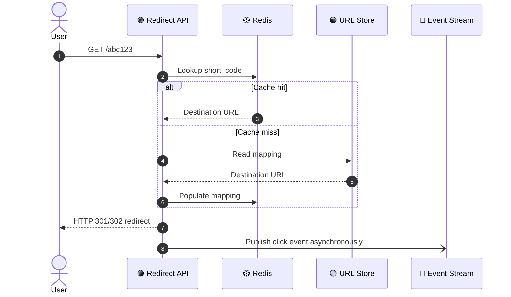

# 🔗 **URL Shortener — Detailed Data Model**

> 🎯 **Goal:** Convert long URLs into compact links, redirect quickly, and capture analytics without slowing down the redirect path.

## 🎨 Visual ER Diagram

## 🚦 Redirect Flow

## 🧱 SHORT_URL

| Field | Type | Key | Description |
|---|---|---|---|
| url_id | UUID | PK | Internal identifier |
| short_code | varchar(20) | UK | Encoded public key |
| owner_user_id | UUID | FK/IDX | Optional owner |
| original_url | text | | Destination URL |
| status | varchar(20) | IDX | Active, disabled, expired |
| expires_at | timestamp | IDX | Optional expiration |
| created_at | timestamp | IDX | Creation time |

## 📊 CLICK_EVENT

| Field | Type | Key | Description |
|---|---|---|---|
| event_id | UUID | PK | Event identifier |
| url_id | UUID | FK/IDX | Short URL |
| occurred_at | timestamp | IDX | Event time |
| country_code | char(2) | | Coarse location |
| referrer | varchar(500) | | Referrer metadata |
| user_agent_hash | varchar(128) | | Privacy-preserving fingerprint |

## 🏷️ URL_TAG

| Field | Type | Key | Description |
|---|---|---|---|
| url_id | UUID | PK/FK | URL |
| tag | varchar(80) | PK | Tag value |

## ⚡ Storage & Design Notes

- 🟢 Store URL mappings in a strongly consistent SQL store or partitioned key-value store.
- 🟡 Cache `short_code → destination` in Redis with TTL and negative caching.
- 🔴 Publish click events asynchronously to Event Hubs/Kafka.
- 📈 Partition analytics by `url_id` and time bucket.
- 🔐 Use a unique index on `short_code` and idempotency keys for custom aliases.
- 🛡️ Validate schemes, block dangerous destinations, and apply rate limiting.

> 💡 **Interview tip:** Keep redirects extremely lightweight. Analytics should happen asynchronously so a slow reporting pipeline never delays the user’s redirect.