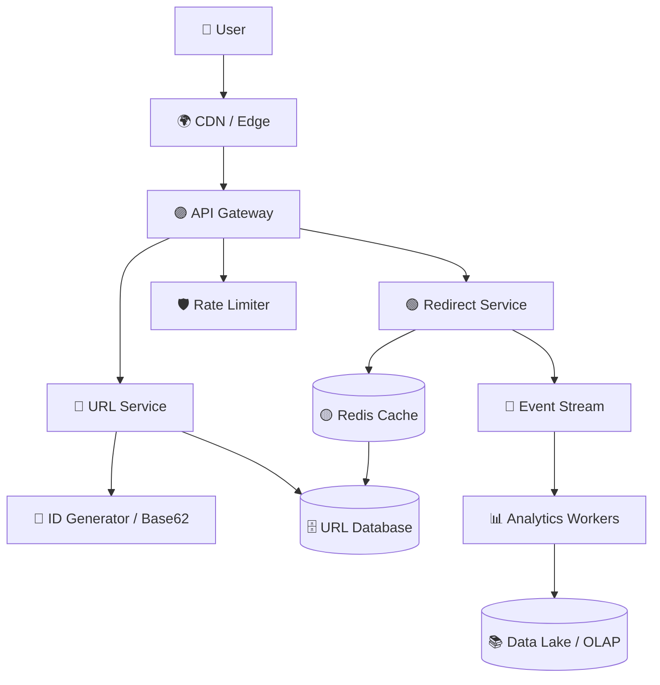
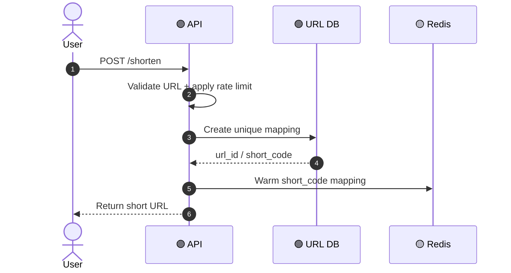
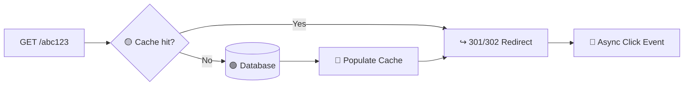

# 🔗 URL Shortener — System Design

> 🎯 **Mission:** Create tiny links, redirect at lightning speed, and scale to millions of clicks without making the user wait.

## 🧩 1. Requirements

### Functional
- Create a short URL from a long URL.
- Redirect using a short code.
- Support custom aliases and expiration.
- Track clicks, referrers, country, and coarse device information.
- Disable or delete links owned by a user.

### Non-functional
- ⚡ Very low redirect latency.
- 📈 High read-to-write ratio.
- 🔐 Abuse prevention and destination validation.
- ♻️ High availability and durable mappings.
- 📊 Analytics must not block redirects.

## 🏗️ 2. High-Level Architecture



## 🔢 3. Capacity Thinking

Example assumptions:

- 10 million new links per day.
- 100:1 read-to-write ratio.
- Approximately 1,000 writes/second on average.
- Approximately 100,000 redirects/second on average, with significant peaks.
- Cache popular mappings because reads dominate writes.

> 💡 **Rule:** Design the redirect path for peak traffic, not average traffic.

## 🔁 4. Create Short URL Flow



## ⚡ 5. Redirect Flow



- Use `301` when the destination is effectively permanent and caching is acceptable.
- Use `302` when destination changes, tracking, or policy requires a temporary redirect.
- Apply negative caching for missing or disabled codes.
- Protect against cache stampedes with request coalescing or short locks.

## 🧮 6. Short-Code Generation

Options:

1. **Base62 encoding:** Encode a unique numeric ID using `[a-zA-Z0-9]`.
2. **Random code:** Generate secure random strings and retry on collision.
3. **Distributed ID + Base62:** Use Snowflake-style IDs for horizontally scaled writers.

> 🧠 **Trade-off:** Sequential IDs are efficient but predictable. Randomized or obfuscated IDs reduce enumeration risk.

## 🗃️ 7. Data Model

Core entities:

- `SHORT_URL(url_id, short_code, original_url, owner_user_id, status, expires_at, created_at)`
- `CLICK_EVENT(event_id, url_id, occurred_at, country_code, referrer, user_agent_hash)`
- `URL_TAG(url_id, tag)`

See the detailed visual model in [`data-model.md`](./data-model.md).

## 🚀 8. Scaling Strategy

- 🟡 Redis cache for hot links and negative lookups.
- 🗄️ Partition the URL store by hash of `short_code` or `url_id`.
- 🌍 Use read replicas where the consistency model permits it.
- 🔴 Stream click events asynchronously through Kafka/Event Hubs.
- 📊 Aggregate analytics in time buckets rather than updating one hot counter per click.
- 🧯 Add circuit breakers, timeouts, bulkheads, and graceful fallback behavior.
- 🌐 Use multi-region reads and carefully designed write ownership if global availability is required.

## 🔐 9. Security & Abuse Controls

- Allow only safe schemes such as `https` and approved `http` use cases.
- Block malware, phishing, private-network targets, and open redirects.
- Rate-limit creation and redirection abuse.
- Add CAPTCHA or identity verification for suspicious behavior.
- Avoid storing raw personal data when a coarse or hashed value is sufficient.
- Protect custom aliases against unauthorized overwrites.

## 📡 10. APIs

```http
POST /v1/urls
GET  /r/{shortCode}
GET  /v1/urls/{shortCode}/analytics
PATCH /v1/urls/{shortCode}
DELETE /v1/urls/{shortCode}
```

Example request:

```json
{
  "originalUrl": "https://example.com/articles/system-design",
  "customAlias": "design",
  "expiresAt": "2027-01-01T00:00:00Z"
}
```

## 🩺 11. Observability

Track:

- Redirect p50/p95/p99 latency.
- Cache hit ratio and negative-cache ratio.
- Database latency and error rate.
- Redirects per second and hot-key distribution.
- Event-stream lag and analytics freshness.
- Abuse detections, blocked destinations, and rate-limit responses.

## 🎤 Interview Summary

> A URL shortener is a **read-heavy, latency-sensitive system**. Keep the redirect path small: check cache, fetch from the database on a miss, return the redirect, and publish analytics asynchronously. Scale with caching, partitioning, unique key enforcement, and strong abuse controls.