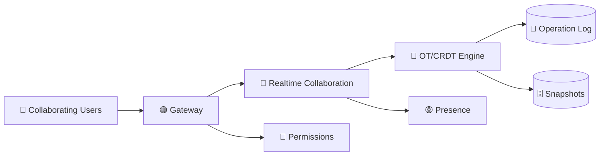

# 📝 Google Docs-like Collaboration System Design

> 📘 **Primary interview guide:** [Open the complete visual solution](06-Google-Docs/solution.md)

## 🎯 Core Topics
- Real-time collaboration using OT or CRDT
- Operation ordering and conflict resolution
- Snapshots plus append-only operation logs
- Presence, permissions, comments, and version history
- Recovery, scaling, security, and observability

The detailed solution contains the complete architecture, request flows, data model, and interview trade-offs.