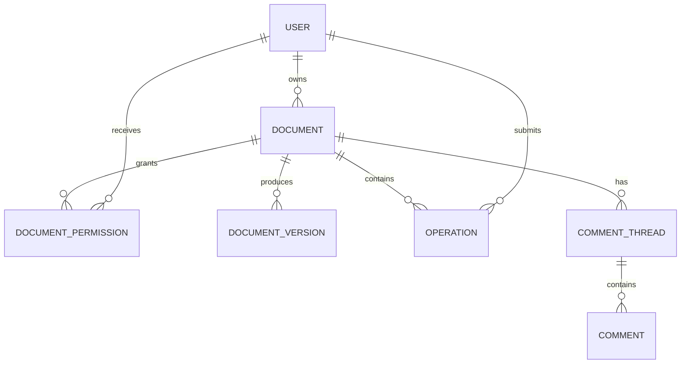

# Google Docs-like Collaboration — Detailed Data Model

## ER Diagram

## DOCUMENT
| Field | Type | Key | Description |
|---|---|---|---|
| document_id | UUID | PK | Document ID |
| owner_user_id | UUID | FK/IDX | Owner |
| title | varchar(500) | | Document title |
| current_version | bigint | | Logical version |
| status | varchar(20) | IDX | Active, archived, deleted |
| created_at | timestamp | | Creation time |
| updated_at | timestamp | IDX | Last update |

## DOCUMENT_PERMISSION
| Field | Type | Key | Description |
|---|---|---|---|
| document_id | UUID | PK/FK | Document |
| user_id | UUID | PK/FK | Principal |
| role | varchar(20) | | Viewer, commenter, editor, owner |
| expires_at | timestamp | | Optional expiration |
| updated_at | timestamp | | Permission update |

## DOCUMENT_VERSION
| Field | Type | Key | Description |
|---|---|---|---|
| document_id | UUID | PK/FK | Document |
| version_number | bigint | PK | Version sequence |
| snapshot_uri | varchar(500) | | Blob snapshot location |
| created_by | UUID | FK | Author |
| created_at | timestamp | | Snapshot time |

## OPERATION
| Field | Type | Key | Description |
|---|---|---|---|
| operation_id | UUID/ULID | PK | Operation ID |
| document_id | UUID | FK/IDX | Document partition |
| client_id | UUID | | Client identity |
| client_sequence | bigint | | Client ordering |
| operation_type | varchar(30) | | Insert, delete, format, move |
| operation_payload | jsonb/blob | | OT/CRDT operation |
| server_version | bigint | IDX | Applied document version |
| created_at | timestamp | | Submission time |

## COMMENT_THREAD / COMMENT
| Entity | Field | Type | Key |
|---|---|---|---|
| COMMENT_THREAD | thread_id | UUID | PK |
| COMMENT_THREAD | document_id | UUID | FK/IDX |
| COMMENT_THREAD | anchor_json | jsonb | | Text/range anchor |
| COMMENT_THREAD | status | varchar(20) | | Open, resolved |
| COMMENT | comment_id | UUID | PK |
| COMMENT | thread_id | UUID | FK |
| COMMENT | author_user_id | UUID | FK |
| COMMENT | body | text | |
| COMMENT | created_at | timestamp | |

## Storage and Design
- Store recent operations in a durable log partitioned by `document_id`.
- Periodically create snapshots in Blob Storage to bound replay time.
- Use optimistic concurrency with server versions; reject or transform stale operations.
- OT or CRDT logic belongs in the collaboration service, not in the relational database.
- Cache permissions carefully and invalidate on every permission change.
- Use append-only audit events for sharing, permission changes, and document recovery.
