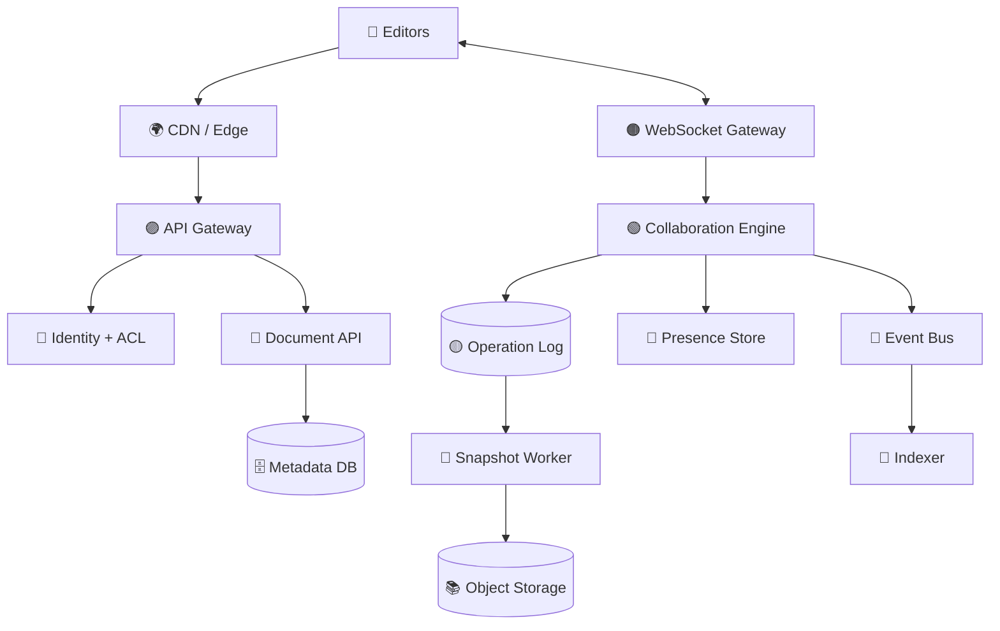
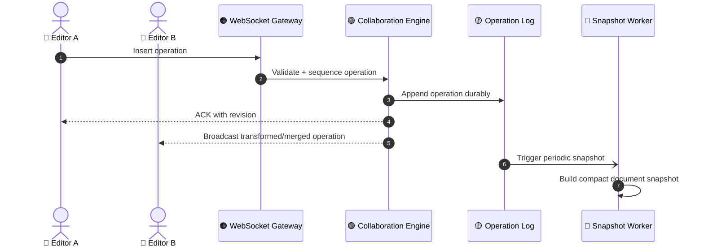

# 📝 Google Docs — Collaborative Document Editor

> 🎯 **Mission:** Let many users edit the same document in real time while preserving ordering, durability, permissions, and a smooth typing experience.

## 🧩 1. Requirements

### Functional
- Create, read, rename, share, and delete documents.
- Support concurrent editing by multiple users.
- Maintain document history and restore previous versions.
- Provide comments, suggestions, and presence indicators.
- Support offline edits and later synchronization.

### Non-functional
- ⚡ Low typing latency.
- 🔄 Conflict-free concurrent editing.
- 🛡️ Strong authorization and tenant isolation.
- 💾 Durable version history.
- 📈 Horizontal scalability for hot documents.

## 🏗️ 2. High-Level Architecture

## ✍️ 3. Editing Model

Two common approaches:

- **OT (Operational Transformation):** Transform concurrent operations against one another before applying them.
- **CRDT:** Represent document state with mergeable operations and deterministic conflict resolution.

> 💡 For an interview, explain the chosen model clearly. The collaboration layer must define operation IDs, ordering, retries, acknowledgements, and recovery after reconnect.

## 🔁 4. Real-Time Edit Flow

## 🧱 5. Core Data

- `DOCUMENT`: document ID, owner, title, current revision, created/updated timestamps.
- `DOCUMENT_MEMBER`: document ID, user ID, role, invitation state.
- `OPERATION`: operation ID, document ID, actor ID, base revision, payload, sequence number, timestamp.
- `SNAPSHOT`: document ID, revision, content pointer, checksum, created timestamp.
- `COMMENT`: comment ID, document ID, anchor range, author, status.

See [`data-model.md`](./data-model.md) for the detailed model.

## 📈 6. Scaling Strategy

- Partition collaboration sessions by `document_id`.
- Route all operations for one active document to the same logical collaboration shard when possible.
- Persist operations in an append-only log before acknowledging them.
- Create snapshots periodically to avoid replaying the entire history.
- Use presence data with short TTLs because it is ephemeral.
- Apply backpressure for large pastes and bursty clients.
- Use lazy loading for document history and comments.

## 🔐 7. Consistency & Recovery

- Every operation carries an operation ID for idempotency.
- Every client tracks the last acknowledged revision.
- On reconnect, the client sends its last known revision and receives missing operations or a fresh snapshot.
- Validate permissions at connection time and for sensitive operations.
- Use checksums to detect corrupted snapshots or incomplete synchronization.

## 🛡️ 8. Security

- Enforce document-level ACLs: owner, editor, commenter, viewer.
- Encrypt data in transit and at rest.
- Audit sharing, permission changes, exports, and deletions.
- Prevent unauthorized access through guessed document IDs.
- Apply rate limits to invitations, exports, and collaboration connections.

## 📡 9. Observability

Monitor:

- Keystroke-to-acknowledgement latency.
- WebSocket connection count and reconnect rate.
- Operation-log append latency.
- Conflict/transform retry rate.
- Snapshot lag and replay duration.
- Hot-document shard load.
- Permission-denied and suspicious-sharing events.

## 🎤 Interview Summary

> A collaborative editor is a **state synchronization system**, not just a CRUD application. Separate metadata APIs from the real-time collaboration path, persist operations durably, use OT or CRDT for concurrency, create snapshots for fast recovery, and route each document’s active session consistently.