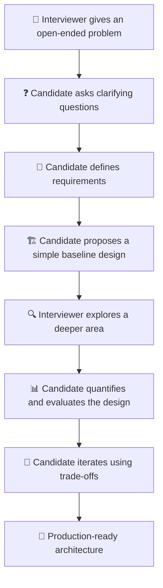
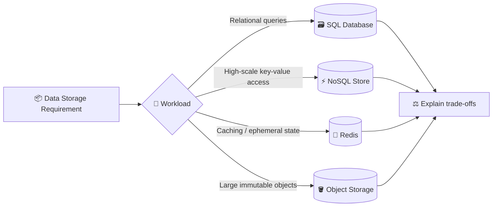
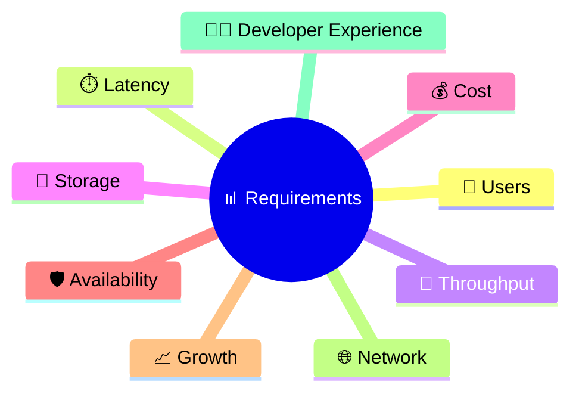
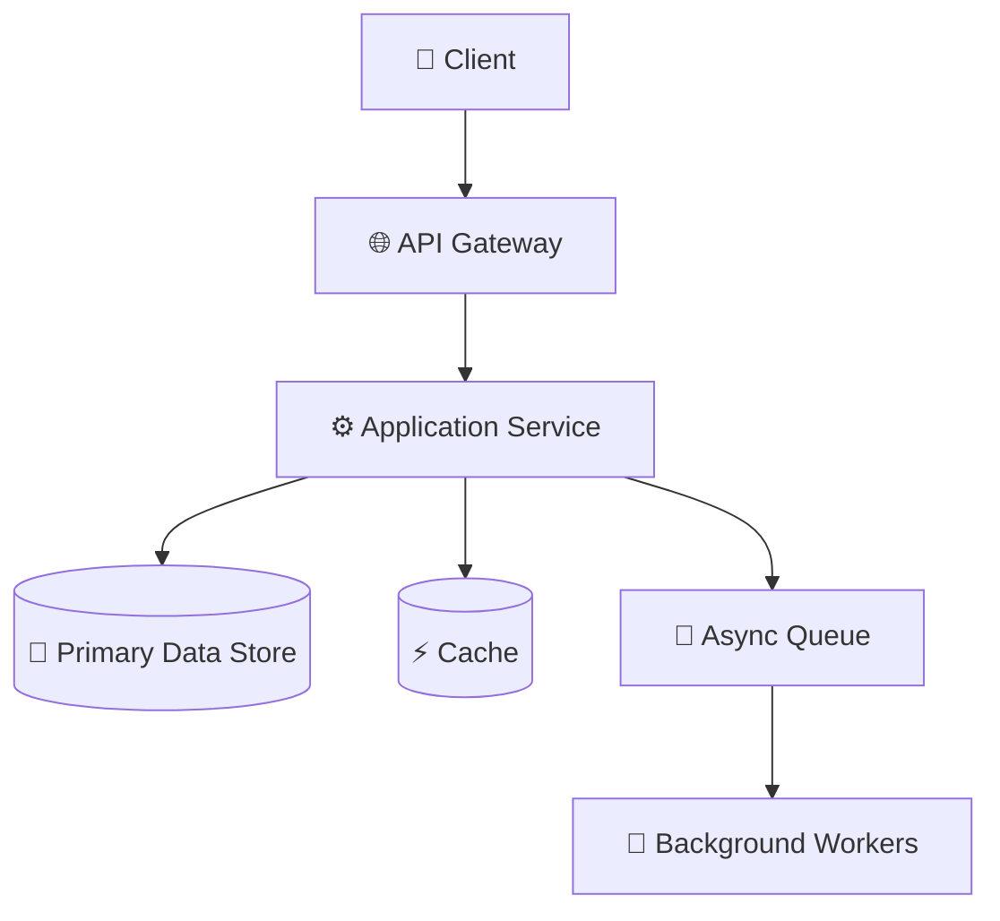
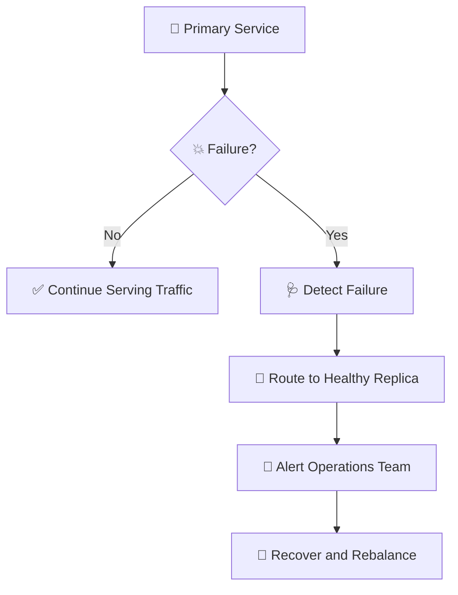

# 🚀 Google System Design Interview Preparation Guide

> **Source & context:** These preparation guidelines were shared with **Azam by Danish Shams, Google Recruiter**, in an email titled **“System Design: Prep Materials for Google Interviews”** dated **October 5, 2023**.
>
> This document reorganizes those recommendations into an interview-friendly, visual learning guide. It is a preparation aid—not an official or exhaustive representation of every Google interview loop.

---

## 🌈 1. What Is a System Design Interview?

A system design interview is a collaborative conversation where you design a solution to a real-world engineering problem.

The problem may involve:

- 🏗️ Large-scale service architecture — such as Gmail or Google Maps
- ⚙️ Algorithms and system-level logic
- 💾 Data storage and retrieval
- 🌐 Network behavior and distributed systems
- 🖥️ Hardware or infrastructure constraints
- 📈 Scalability, reliability, and production operations

### 🎬 The Interview Is a Conversation

You are expected to take the lead, explain your thinking, ask questions, and explore areas where you have depth.



> 💡 **Mindset:** Do not try to guess the “perfect” architecture immediately. Demonstrate structured thinking, adaptability, and engineering judgment.

---

## 🎯 2. What Are Interviewers Looking For?

### 📊 A. Concrete, Realistic, Quantitative Design

Your design should be grounded in realistic assumptions and numbers.

Discuss items such as:

- 👥 Number of users and active users
- 🔄 Requests per second (QPS)
- 💾 Storage growth
- 🌐 Bandwidth and network traffic
- 🖥️ Number of machines or service instances
- ⏱️ Target latency and availability
- 📈 Peak traffic and traffic patterns

**Example questions to ask yourself:**

- How many requests arrive per second?
- What is the peak-to-average traffic ratio?
- How much data is generated every day?
- How many servers or partitions might be required?

### 🔌 B. API and Interface Design

Design interfaces that are easy to use, maintain, and integrate with other teams and existing systems.

Consider:

- Clear resource and endpoint naming
- Request and response contracts
- Idempotency
- Pagination and filtering
- Authentication and authorization
- Versioning and backward compatibility
- Error handling and retry behavior

### ⚡ C. System Properties

Explain what your architecture optimizes for.

| Property | Questions to Explore |
|---|---|
| Latency | Is the system optimized for fast reads or writes? |
| Throughput | How much traffic can it process? |
| Availability | Can the system continue during component failures? |
| Consistency | Do users need strong or eventual consistency? |
| Durability | Can committed data survive failures? |
| Scalability | Can capacity increase without redesigning everything? |
| Maintainability | Can teams evolve components independently? |
| Cost | What are the infrastructure and operational trade-offs? |

### ⚖️ D. Trade-offs and Alternatives

Avoid saying only: **“We will use a database.”**

Instead, explain:

1. Which database or storage model you selected
2. Why it fits the workload
3. What alternatives were considered
4. Which limitations the selected option introduces
5. How the design could change at a larger scale



### 🛡️ E. Productionization: Reliability and Scale

Explain how the design becomes a dependable production system.

Discuss:

- Health checks and graceful degradation
- Timeouts, retries, and circuit breakers
- Replication and failover
- Monitoring, logging, and alerting
- Disaster recovery
- Capacity planning and autoscaling
- Backup and restore procedures
- Data-center or region outage handling

---

## 🧠 3. How to Prepare

### 📚 Review Distributed Systems Concepts

Focus on the fundamentals:

- Client-server architecture
- Load balancing
- Caching
- Database indexing and partitioning
- Replication and consistency
- Message queues and event-driven architecture
- CAP theorem and consistency models
- Consensus fundamentals
- Distributed locking
- Idempotency and deduplication
- Rate limiting
- Fault tolerance and disaster recovery

### 📐 Think Across the Entire Requirement Spectrum

During preparation, practice estimating:



Ask yourself:

- What is an acceptable latency target, and why?
- How robust is the design under partial failure?
- How will the system scale with user growth?
- How will the system be operated in production?
- Which components should remain flexible?
- Which contracts or decisions should remain stable?

### 🧩 Design for Flexibility

Separate stable contracts from replaceable implementations.

| Keep Stable | Keep Replaceable Where Practical |
|---|---|
| Public API contracts | Storage implementation |
| Domain events | Cache technology |
| Authentication boundaries | Internal queue provider |
| Business invariants | Deployment topology |
| Data ownership rules | Indexing strategy |

---

## 🪜 4. Recommended Interview Approach

### 1️⃣ Scope the Requirements

**Always ask clarifying questions.** The initial problem statement is intentionally incomplete.

Clarify:

- Who are the users?
- What are the core use cases?
- What is in scope and out of scope?
- What is the expected scale?
- Are reads or writes more important?
- What are the latency and availability expectations?
- Is strong consistency required?
- What are the security and compliance constraints?

### 2️⃣ Design the Solution

Start with a simple, understandable design.



> 🌱 **Start simple:** Establish a working baseline before adding sharding, multi-region deployment, complex queues, or advanced consistency mechanisms.

### 3️⃣ Deep Dive into Subsystems

Choose the area that matters most to the problem:

- Feed generation
- Search indexing
- Storage partitioning
- Real-time communication
- Media processing
- Authentication
- Notifications
- Consistency and conflict resolution

### 4️⃣ Iterate and Improve

Adapt the architecture as new constraints appear.

Evaluate:

- 📈 Scalability
- 🛡️ Reliability
- 🔄 Flexibility
- 🧹 Maintainability
- 💰 Cost
- 🔐 Security
- 📊 Observability

### 5️⃣ Always Discuss Backup Plans

Ask:

> 🚨 “What happens if a machine, zone, region, database replica, or data center fails?”



---

## 🧪 5. Practice Checklist

Before finishing a mock interview, verify that you covered:

- [ ] 🎯 Functional requirements
- [ ] 🚫 Non-functional requirements
- [ ] 📊 Capacity estimates
- [ ] 🔌 API contracts
- [ ] 🏗️ High-level architecture
- [ ] 🔄 Main request and data flows
- [ ] 💾 Data model and storage choice
- [ ] ⚡ Caching strategy
- [ ] 📈 Partitioning and scaling
- [ ] 🔁 Replication and consistency
- [ ] 🛡️ Fault tolerance
- [ ] 🌍 Disaster recovery and regional failure
- [ ] 🔐 Security and authorization
- [ ] 📡 Monitoring and alerting
- [ ] ⚖️ Trade-offs and alternatives
- [ ] 💰 Cost considerations

---

## 📚 6. Recommended Preparation Topics

The recruiter’s material highlighted the following topics. Not every topic is necessarily assessed in every interview.

| Topic | Preparation Focus |
|---|---|
| 🔌 API Design | Contracts, versioning, idempotency, errors |
| 🏗️ Systems Architecture | Services, boundaries, dependencies |
| 📊 Capacity / Latency / Throughput | Estimation and bottleneck analysis |
| 📈 Scalability | Horizontal scaling, partitioning, caching |
| 🌐 Network Design | Load balancing, routing, protocols |
| 🛡️ Fault Tolerance | Replication, failover, graceful degradation |
| ⚖️ System Interactions & Trade-offs | Alternatives, constraints, consequences |

---

## 📖 7. Suggested Reading and Learning Resources

The recruiter’s email referenced these categories of resources:

- ⏱️ **Latency Numbers Every Programmer Should Know**
- 🎥 **Building Software Systems at Google and Lessons Learned**
- 🧑‍💻 **Software Engineering Advice from Building Large-Scale Distributed Systems**
- 🧠 **How to Ace a Systems Design Interview**
- 📘 **System Design Interview preparation materials**
- 📚 Distributed systems and parallel computing
- 📚 MapReduce: Simplified Data Processing on Large Clusters
- 📚 Bigtable: A Distributed Storage System for Structured Data
- 📚 The Google File System

> 🔎 Use these as study directions. Verify the current availability and source of each resource before relying on it.

---

## 🗣️ 8. A Practical Answer Structure

Use this repeatable flow during practice:

```text
1. Clarify the problem
2. Define functional requirements
3. Define non-functional requirements
4. Estimate scale and capacity
5. Propose APIs and data model
6. Draw the high-level architecture
7. Explain the critical request flows
8. Deep dive into the most important subsystem
9. Discuss bottlenecks and failure scenarios
10. Explain scaling, reliability, and observability
11. Compare alternatives and trade-offs
12. Summarize the final design
```

### 🎤 Useful Phrases During the Interview

- “Let me clarify the expected scale and the most important use cases.”
- “I’ll start with a simple baseline and then evolve it for scale.”
- “This choice optimizes for latency, but the trade-off is…”
- “An alternative would be…, which is useful when…”
- “If this component fails, the fallback behavior would be…”
- “At higher scale, the likely bottleneck is…”
- “I’ll make this assumption explicit so we can revise it if needed.”

---

## 🏁 9. Final Takeaways

> 🌟 **Think like a production engineer, not only a diagram designer.**

A strong system design discussion connects:

**Requirements → Estimates → APIs → Architecture → Data → Trade-offs → Reliability → Scale**

The objective is not to present the most complicated architecture. The objective is to demonstrate that you can build a realistic system, explain its behavior, recognize its limitations, and improve it thoughtfully.

---

## 🔗 Related Guides in This Repository

- [System Design Index](./README.md)
- [E-Commerce / Amazon](./01-E-Commerce-Amazon/solution.md)
- [YouTube](./02-YouTube/solution.md)
- [WhatsApp](./03-WhatsApp/solution.md)
- [Facebook / Instagram](./04-Facebook-Instagram/solution.md)
- [URL Shortener](./05-URL-Shortener/solution.md)
- [Google Docs](./06-Google-Docs/solution.md)

---

**Prepared for interview learning and practice based on recruiter-shared guidance.**