# ☁️ Azure Interview Questions & Answers — Principal / Staff Engineer

[](https://azure.microsoft.com/)
[](https://azure.microsoft.com/products/functions)
[](https://azure.microsoft.com/products/service-bus)
[](https://azure.microsoft.com/products/event-hubs)
[](https://azure.microsoft.com/products/event-grid)
[](https://www.microsoft.com/security/business/identity-access/microsoft-entra-id)
[](https://azure.microsoft.com/products/key-vault)
[](https://azure.microsoft.com/products/app-service)
[](https://azure.microsoft.com/products/api-management)
[](https://azure.microsoft.com/products/storage)
[](https://azure.microsoft.com/products/cosmos-db)
[](https://azure.microsoft.com/products/data-factory)
[](https://azure.microsoft.com/products/logic-apps)
[](https://azure.microsoft.com/products/kubernetes-service)
[](https://azure.microsoft.com/products/ai-services/openai-service)

[](https://dotnet.microsoft.com/)
[](https://learn.microsoft.com/dotnet/csharp/)
[](https://www.python.org/)
[](https://www.docker.com/)
[](https://kubernetes.io/)
[](https://github.com/features/actions)
[](https://www.markdownguide.org/)

> 🎯 **Interview focus:** Azure PaaS, event-driven architecture, serverless, data integration, security, networking, observability, API management, containers, and GenAI.

> 💡 **Interview format:** Every question starts with a one-line answer, followed by the reasoning, architecture/flow, and practical code or configuration where useful.

**Tags:** `#Azure` `#AzureFunctions` `#ServiceBus` `#EventHub` `#EventGrid` `#EntraID` `#KeyVault` `#AppService` `#APIM` `#CosmosDB` `#DataFactory` `#ADF` `#AKS` `#AzureOpenAI` `#SystemDesign` `#CloudArchitecture`

---

## 📚 Table of Contents

1. [Azure Functions](#1-azure-functions)
2. [Service Bus, Event Hub and Event Grid](#2-service-bus-event-hub-and-event-grid)
3. [Authentication, Key Vault and Secure Access](#3-authentication-key-vault-and-secure-access)
4. [App Service, Deployment and Monitoring](#4-app-service-deployment-and-monitoring)
5. [API Management and Networking](#5-api-management-and-networking)
6. [Storage and Cosmos DB](#6-storage-and-cosmos-db)
7. [Logic Apps and Data Factory](#7-logic-apps-and-data-factory)
8. [Containers and Azure OpenAI](#8-containers-and-azure-openai)
9. [Rapid Interview Cheat Sheet](#9-rapid-interview-cheat-sheet)

---

# 1. ⚡ Azure Functions

## Q1. What are Azure Functions, and when would you use them?

**One-line answer:** Azure Functions is Azure's serverless compute platform for running event-driven code without managing servers.

### Step-by-step

1. A trigger starts the function — HTTP, Service Bus, Event Grid, Timer, Blob, etc.
2. Azure allocates compute and executes the function.
3. Bindings can simplify interaction with Azure services.
4. The function returns or emits an event/message.
5. Scaling is handled according to the selected hosting plan.

### When I would use it

| Use case | Why Functions? |
|---|---|
| HTTP API | Lightweight serverless endpoint |
| File processing | Trigger when a Blob arrives |
| Queue processing | Consume Service Bus messages |
| Scheduled jobs | Timer trigger |
| Event-driven integration | Event Grid / Service Bus |
| ETL orchestration | Often with Durable Functions / ADF |

### Flow

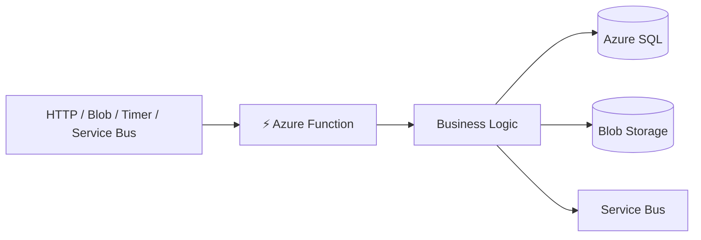

### C# example

```csharp
[Function("ProcessOrder")]
public async Task Run(
    [ServiceBusTrigger("orders", Connection = "ServiceBus")]
    ServiceBusReceivedMessage message)
{
    var order = JsonSerializer.Deserialize<Order>(message.Body);
    await orderService.ProcessAsync(order!);
}
```

**Interview tip:** Don't say "Functions are only for small workloads." They can handle serious production workloads when the hosting plan, scaling model, concurrency, idempotency and observability are designed correctly.

---

## Q2. What are Durable Functions?

**One-line answer:** Durable Functions extend Azure Functions with stateful orchestration for long-running, reliable workflows.

### Step-by-step

1. **Orchestrator** defines workflow.
2. **Activity functions** perform individual tasks.
3. Durable runtime persists workflow state.
4. Failed activities can be retried.
5. The workflow can wait for timers or external events.

### Flow

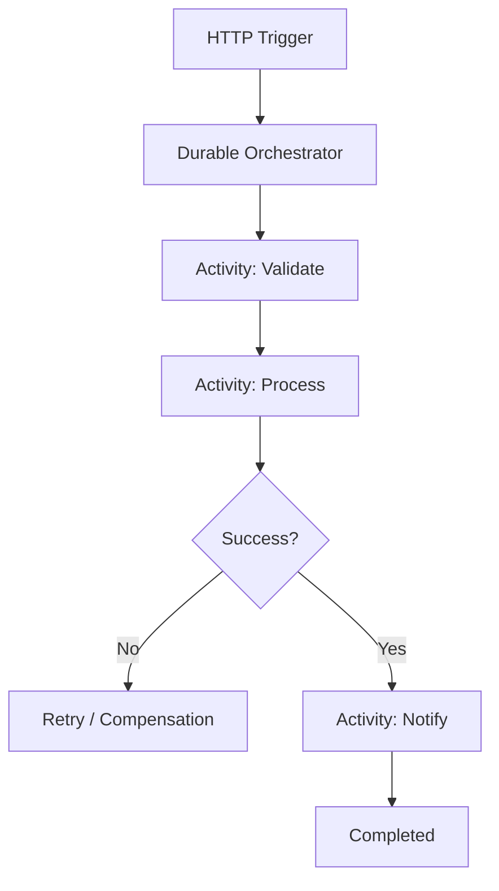

### C# example

```csharp
[Function("OrderOrchestrator")]
public static async Task<string> Run(
    [OrchestrationTrigger] TaskOrchestrationContext context)
{
    await context.CallActivityAsync("ValidateOrder", null);
    await context.CallActivityAsync("ReserveInventory", null);
    await context.CallActivityAsync("ChargePayment", null);

    return "Completed";
}
```

**Use it for:** approval workflows, order processing, document processing, multi-step integrations and long-running jobs.

---

## Q3. How do you handle state management in Azure Functions?

**One-line answer:** Keep Functions stateless and externalize state to durable/state stores such as Durable Functions, Azure SQL, Cosmos DB, Blob Storage or Redis.

### Step-by-step

1. Don't depend on local memory for durable state.
2. Store business state externally.
3. Use a correlation/workflow ID.
4. Make operations idempotent.
5. Use Durable Functions when workflow state itself must be persisted.

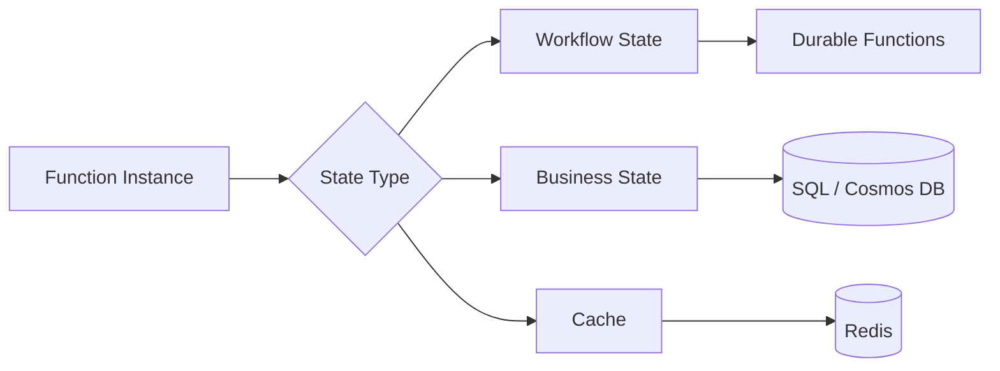

---

## Q4. What is cold start, and how do you minimize its impact?

**One-line answer:** Cold start is the latency introduced when Azure needs to initialize a new function host before processing a request.

### Step-by-step

1. Function has no warm worker.
2. Platform starts/assigns an instance.
3. Runtime loads dependencies.
4. Application initializes.
5. Request executes.

### Reduce cold start

- Use **Premium plan** with pre-warmed instances.
- Use **Always Ready** instances where supported.
- Keep startup code lightweight.
- Reduce dependency count.
- Avoid expensive work during application startup.
- Use appropriate runtime versions.
- Consider App Service Plan for predictable workloads.

---

## Q5. How do you ensure pre-warmed Azure Function instances using an App Service Plan?

**One-line answer:** Use an App Service Plan with sufficient always-on instances and enable `Always On` so the application remains initialized rather than relying on scale-to-zero behavior.

### Example configuration

```yaml
siteConfig:
  alwaysOn: true
  minimumElasticInstanceCount: 2
```

### Interview nuance

For Azure Functions, hosting-plan capabilities differ by plan and runtime. In a real design, I would choose **Premium / App Service Plan / Flex Consumption** based on latency, scaling, workload and cost requirements rather than blindly selecting one.

---

# 2. 🚌 Service Bus, Event Hub and Event Grid

## Q6. What is Azure Service Bus, and why would you use it?

**One-line answer:** Azure Service Bus is a managed enterprise messaging service used for reliable asynchronous communication between applications.

### Step-by-step

1. Producer sends message.
2. Service Bus persists the message.
3. Consumer receives it.
4. Consumer completes the message after successful processing.
5. Failed processing can result in retry/dead-lettering.

### Flow

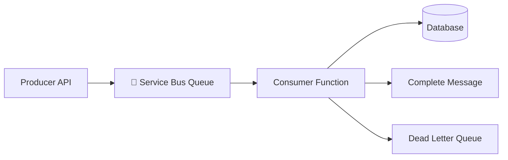

### Why Service Bus?

- Queues
- Topics/subscriptions
- FIFO-like ordering through sessions
- Dead-letter queues
- Retries
- Duplicate detection
- Transactions
- Scheduled messages

---

## Q7. Difference between Service Bus and Event Hub?

**One-line answer:** Service Bus is for reliable enterprise messaging and workflows, while Event Hubs is optimized for high-throughput event streaming and telemetry.

| Feature | Service Bus | Event Hubs |
|---|---|---|
| Primary purpose | Enterprise messaging | Event streaming |
| Ordering | Sessions | Partition ordering |
| Dead-letter queue | ✅ | ❌ traditional DLQ |
| Pub/Sub | Topics | Consumer groups |
| Typical workload | Commands/workflows | Telemetry/logs |
| Replay | Limited/message lifecycle | Strong event-stream replay |
| Throughput model | Message-oriented | Stream-oriented |

### Rule of thumb

```text
Business command → Service Bus
IoT / telemetry / clickstream → Event Hubs
```

---

## Q8. How does Event Grid differ from Service Bus and Event Hub?

**One-line answer:** Event Grid is primarily a lightweight event notification/router, Service Bus is reliable enterprise messaging, and Event Hubs is high-throughput streaming.

```mermaid
flowchart TD
    A[Event Producer] --> B{Azure Messaging Choice}
    B --> C[Event Grid<br/>"Something happened"]
    B --> D[Service Bus<br/>"Please process this"]
    B --> E[Event Hubs<br/>"Here is a stream of events"]
```

---

## Q9. How do you prevent duplicate message or transaction processing in Service Bus?

**One-line answer:** Use idempotent consumers, stable business/message IDs, duplicate detection where appropriate, and transactional processing when atomicity is required.

### Step-by-step

1. Assign a unique `MessageId`.
2. Store processed IDs or use a business idempotency key.
3. Check whether the operation was already completed.
4. Perform the business operation.
5. Mark it completed atomically where possible.
6. Complete the message.

```csharp
if (await repository.AlreadyProcessedAsync(message.MessageId))
    return;

await repository.ProcessAsync(message);
await repository.MarkProcessedAsync(message.MessageId);
```

**Important:** `MessageId` duplicate detection is not a replacement for application-level idempotency.

---

## Q10. How do you ensure message reliability in Service Bus?

**One-line answer:** Use Peek-Lock, retries, idempotent consumers, dead-letter queues, appropriate lock duration and observability.

### Flow

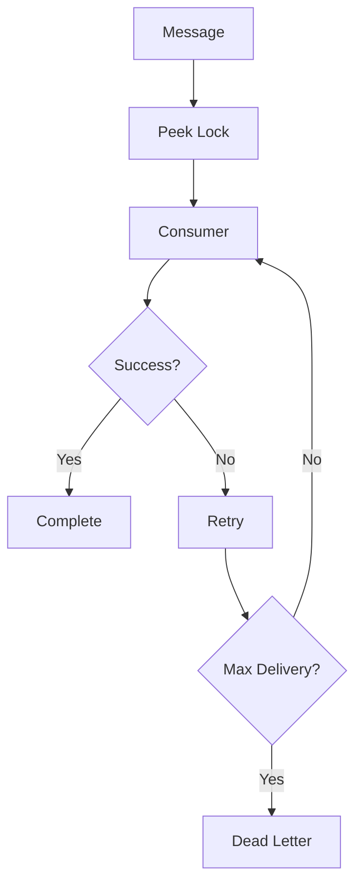

---

## Q11. How do you implement ordered message processing in Service Bus?

**One-line answer:** Use Service Bus Sessions and assign the same `SessionId` to messages that must be processed in order.

```csharp
new ServiceBusMessage(BinaryData.FromObjectAsJson(order))
{
    MessageId = order.Id.ToString(),
    SessionId = order.CustomerId.ToString()
};
```

**Key point:** Ordering is maintained **within a session**, not globally across all messages.

---

## Q12. How do you handle poison messages in Service Bus?

**One-line answer:** Let transient failures retry, then move repeatedly failing messages to the Dead Letter Queue for inspection and controlled remediation.

### Process

```text
Message
  ↓
Process
  ↓
Failure
  ↓
Retry
  ↓
Max delivery count
  ↓
Dead Letter Queue
  ↓
Alert + Diagnose
  ↓
Fix / Replay / Discard
```

---

## Q13. How do you monitor and handle a growing Service Bus backlog?

**One-line answer:** Monitor active message count and age, identify the bottleneck, scale consumers, and investigate downstream dependencies.

### Troubleshooting sequence

1. Check active message count.
2. Check oldest message age.
3. Check consumer errors.
4. Check Function/AKS throughput.
5. Check database latency/throttling.
6. Increase consumer instances where safe.
7. Optimize processing.
8. Check for poison messages.

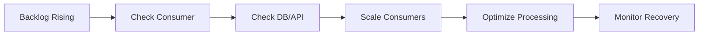

---

## Q14. How would you handle a Service Bus message growing from 5 KB to 5 MB?

**One-line answer:** Don't blindly send large payloads through Service Bus; store the payload in Blob Storage and send a small reference message.

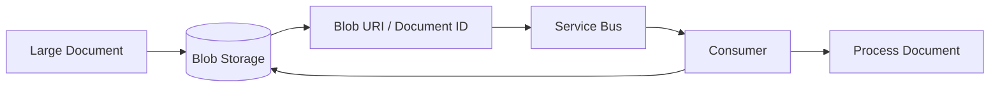

### Example message

```json
{
  "documentId": "DOC-10045",
  "container": "documents",
  "blobName": "2026/10/DOC-10045.pdf",
  "eventType": "DocumentUploaded"
}
```

**Architecture principle:** Use messaging for coordination and Blob Storage for large payloads.

---

# 3. 🔐 Authentication, Key Vault and Secure Access

## Q15. How do you implement authentication using Microsoft Entra ID / Azure AD?

**One-line answer:** Register the application in Microsoft Entra ID, issue OAuth 2.0/OIDC tokens, validate JWT claims at the API, and authorize based on scopes or roles.

### Flow

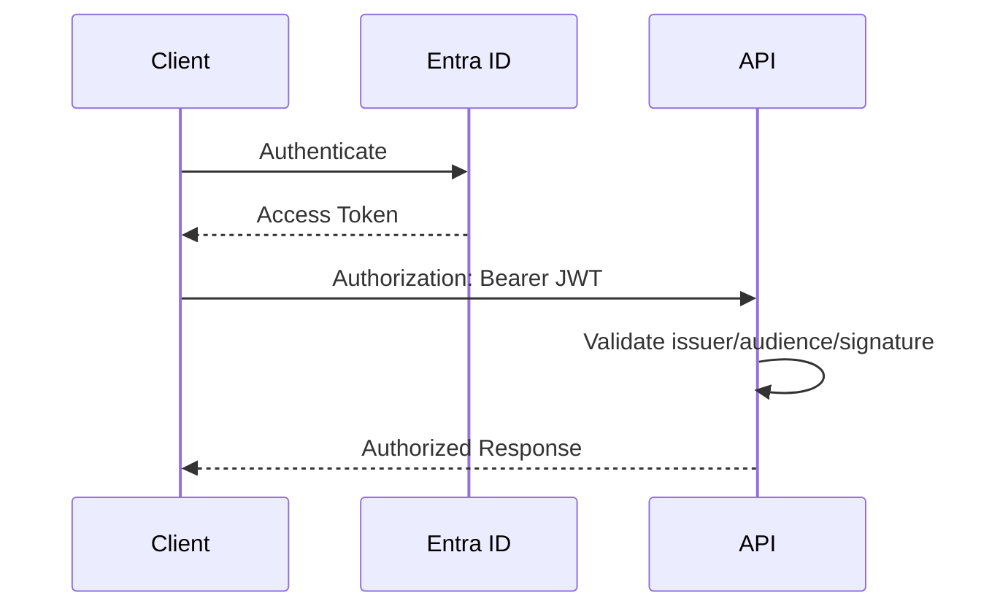

### ASP.NET Core

```csharp
builder.Services.AddAuthentication("Bearer")
    .AddJwtBearer(options =>
    {
        options.Authority =
            "https://login.microsoftonline.com/{tenant-id}/v2.0";
        options.Audience = "api://my-api";
    });

builder.Services.AddAuthorization();
```

---

## Q16. How do you integrate Azure Key Vault with a .NET application?

**One-line answer:** Use Microsoft Entra ID with Managed Identity so the application retrieves secrets from Key Vault without storing credentials in code.

### Flow

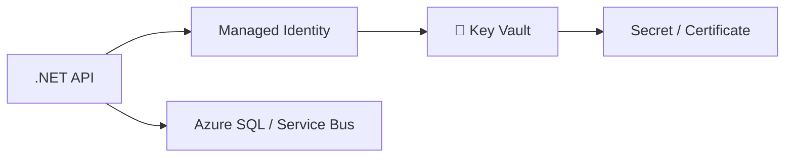

### C#

```csharp
var credential = new DefaultAzureCredential();

var client = new SecretClient(
    new Uri("https://myvault.vault.azure.net/"),
    credential);

KeyVaultSecret secret =
    await client.GetSecretAsync("DatabasePassword");
```

---

## Q17. What is the purpose of Azure Key Vault in your project?

**One-line answer:** Key Vault centrally protects secrets, certificates and cryptographic keys while avoiding credentials being embedded in application code or configuration.

### Typical secrets

- Database credentials
- API keys
- Certificates
- Signing keys
- Third-party credentials

**Production principle:** Prefer **Managed Identity + Key Vault** over client secrets whenever Azure supports it.

---

## Q18. How do you connect a .NET Core Web API to a protected Azure resource?

**One-line answer:** Use Managed Identity or workload identity to obtain an Entra token and grant the identity the minimum required RBAC permissions.

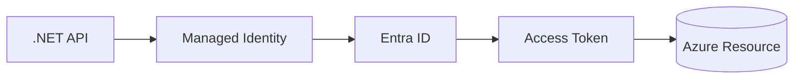

---

## Q19. How does a pod connect to Azure Storage or Key Vault?

**One-line answer:** On AKS, use Microsoft Entra Workload ID so the Kubernetes service account maps to an Azure identity and receives short-lived tokens.

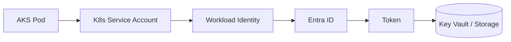

**Avoid:** Hard-coding Azure client secrets inside Kubernetes secrets unless there is a compelling legacy requirement.

---

# 4. 🚀 App Service, Deployment and Monitoring

## Q20. How do you deploy a .NET application or Web API to Azure?

**One-line answer:** Build and test the application in CI, publish the artifact/container, deploy to App Service or another compute platform, run health checks, and monitor the release.

### CI/CD

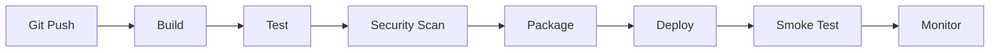

### Example GitHub Actions

```yaml
name: deploy-api

on:
  push:
    branches: [main]

jobs:
  build-deploy:
    runs-on: ubuntu-latest

    steps:
      - uses: actions/checkout@v4

      - uses: actions/setup-dotnet@v4
        with:
          dotnet-version: '8.0.x'

      - run: dotnet restore
      - run: dotnet build --no-restore --configuration Release
      - run: dotnet test --no-build --configuration Release
      - run: dotnet publish -c Release -o publish

      # Deployment step depends on the selected Azure deployment method.
```

---

## Q21. Why would you choose Azure App Service to host a Web API?

**One-line answer:** App Service provides managed web hosting with built-in scaling, deployment slots, TLS, authentication integrations and monitoring without managing VMs.

### When it fits

- REST APIs
- Web applications
- Background web workloads
- Moderate-to-high scale APIs
- Teams wanting PaaS rather than Kubernetes operations

---

## Q22. How do you monitor applications using Application Insights and Azure Monitor?

**One-line answer:** Use Application Insights for application telemetry and Azure Monitor for platform/resource metrics, logs, alerts and operational dashboards.

### Observe

```text
Request
  ├── Duration
  ├── Dependency calls
  ├── Exceptions
  ├── Logs
  └── Distributed Trace
```

### KQL example

```kusto
requests
| where timestamp > ago(30m)
| summarize
    Requests=count(),
    AvgDuration=avg(duration),
    P95=percentile(duration, 95)
  by bin(timestamp, 5m)
| order by timestamp asc
```

---

## Q23. How would you troubleshoot an API that becomes slow after deployment to Azure?

**One-line answer:** Start with telemetry and distributed traces, compare before/after deployment, isolate application vs dependency latency, then fix or roll back based on evidence.

### Production checklist

1. Check Application Insights request duration.
2. Check dependency duration.
3. Check exceptions and failed requests.
4. Check CPU/memory/thread pool.
5. Check SQL query performance.
6. Check external APIs.
7. Check connection pool exhaustion.
8. Check recent deployment/config changes.
9. Compare healthy vs unhealthy instances.
10. Roll back if the release is proven to be the cause.

---

## Q24. Explain the end-to-end request flow through Azure App Service.

**One-line answer:** A client request reaches the Azure ingress/network layer, is routed to App Service, processed by the application, and the response travels back through the same path.

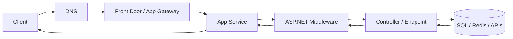

---

## Q25. How would you trace SFTP issues in Azure App Service?

**One-line answer:** Trace the issue from application logs through DNS/network connectivity, authentication, host-key/TLS configuration, firewall rules and the SFTP server logs.

### Checklist

```text
App logs
 ↓
DNS resolution
 ↓
Outbound connectivity
 ↓
NSG / Firewall / NAT
 ↓
SFTP host/port
 ↓
Authentication
 ↓
Host key / TLS settings
 ↓
Remote permissions
 ↓
SFTP server logs
```

**Production tip:** Never log passwords, private keys or sensitive file contents.

---

# 5. 🌐 API Management and Networking

## Q26. What is Azure API Management, and how does it work with backend APIs?

**One-line answer:** Azure API Management is an API gateway and management platform that provides security, throttling, transformation, routing, analytics and lifecycle management around backend APIs.

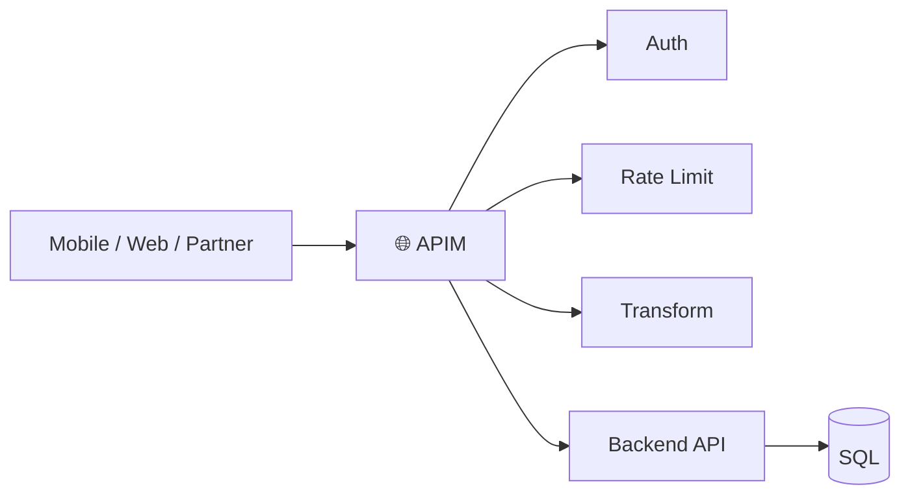

### Typical policies

- JWT validation
- Rate limiting
- Quotas
- Header transformation
- URL rewriting
- Backend routing
- Caching
- IP filtering

---

## Q27. How do you implement APIM policies and validate incoming requests?

**One-line answer:** Use APIM inbound policies to validate JWTs, enforce quotas/rate limits, validate headers/schema where appropriate, and reject invalid requests before reaching the backend.

### Example policy

```xml
<inbound>
    <base />

    <validate-jwt
        header-name="Authorization"
        require-scheme="Bearer"
        failed-validation-httpcode="401">
        <openid-config url="https://login.microsoftonline.com/{tenant}/v2.0/.well-known/openid-configuration" />
        <audiences>
            <audience>api://my-api</audience>
        </audiences>
    </validate-jwt>

    <rate-limit-by-key
        calls="100"
        renewal-period="60"
        counter-key="@(context.Subscription.Key)" />
</inbound>
```

---

## Q28. How do you securely connect APIM → backend API → Azure SQL?

**One-line answer:** Keep the backend and database private where possible, use VNet integration/private endpoints, Managed Identity, Entra authentication and least-privilege RBAC.

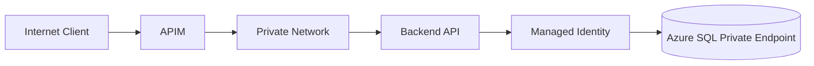

### Security layers

1. TLS everywhere.
2. JWT validation at APIM/API.
3. Private endpoints.
4. Managed Identity.
5. Azure SQL firewall/private networking.
6. Least-privilege permissions.
7. Centralized logging.

---

## Q29. How can public APIM APIs connect to a backend inside a VNet with a private endpoint?

**One-line answer:** Place APIM in a networking configuration that can reach the private backend, resolve private DNS correctly, and route traffic through the VNet/private endpoint.

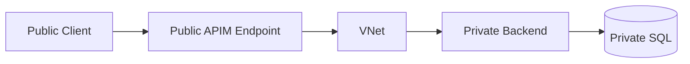

**Interview nuance:** The exact APIM networking model depends on the APIM tier and architecture. Verify private connectivity, DNS and routing as one design rather than treating "private endpoint" as sufficient by itself.

---

## Q30. How do you deploy APIM across multiple regions with budget constraints?

**One-line answer:** Use a primary region plus selective secondary-region capacity, Front Door for global routing, and scale regions based on availability and latency requirements rather than duplicating everything by default.

### Cost-aware architecture

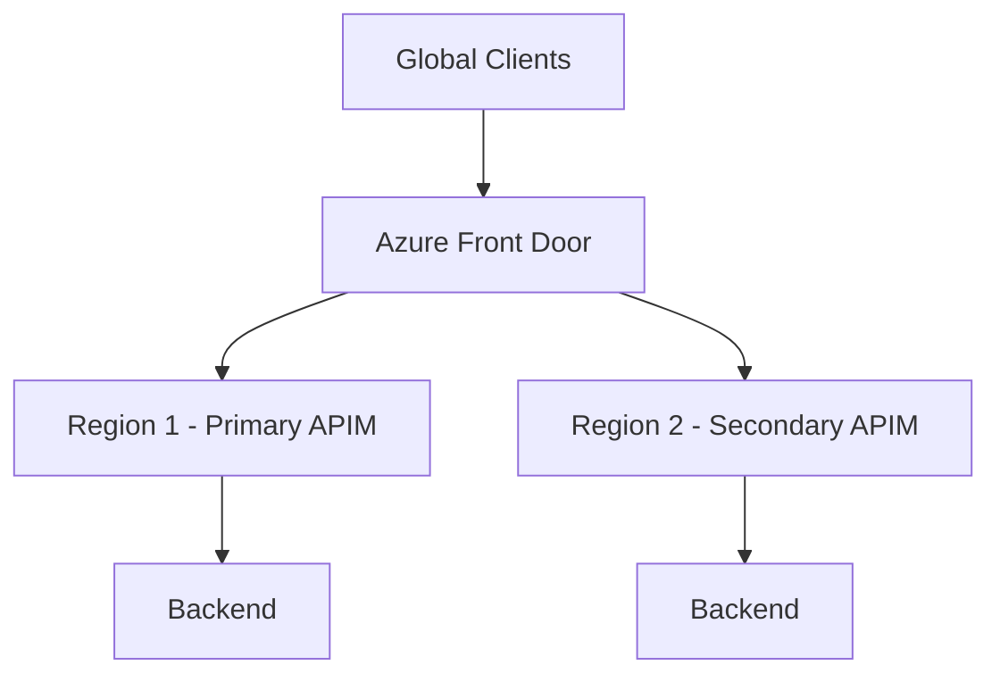

### Decision factors

- SLA
- RTO/RPO
- User geography
- Data residency
- APIM tier
- Traffic volume
- Active-active vs active-passive

---

## Q31. What is Azure Front Door?

**One-line answer:** Azure Front Door is a global Layer-7 application delivery service providing global routing, acceleration, TLS termination, health-based routing and edge security capabilities.

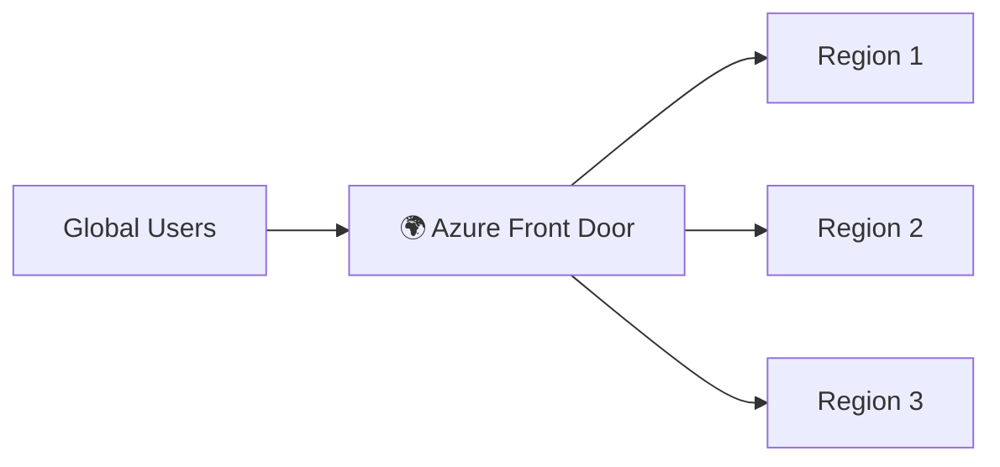

**Think:** Front Door = global entry point; APIM = API gateway/management; Application Gateway = regional application-layer load balancing.

---

# 6. 💾 Storage and Cosmos DB

## Q32. What are Hot, Cool and Archive storage tiers?

**One-line answer:** They are Blob Storage access tiers optimized for different access frequencies and cost profiles.

| Tier | Access pattern | Typical use |
|---|---|---|
| Hot 🔥 | Frequently accessed | Active documents |
| Cool ❄️ | Infrequently accessed | Backups |
| Archive 🗄️ | Rarely accessed | Long-term retention |

### Decision

```text
Frequent access → Hot
↓
Occasional access → Cool
↓
Rare / compliance archive → Archive
```

**Trade-off:** Lower storage cost generally comes with higher access/retrieval constraints and costs.

---

## Q33. Difference between Blob Storage and Table Storage?

**One-line answer:** Blob Storage stores unstructured objects/files, while Table Storage is a NoSQL key-value/document-like store for structured entities.

| Blob | Table |
|---|---|
| Files/objects | Structured entities |
| PDFs/images/videos | Metadata records |
| Large payloads | Key-value style data |
| Containers + blobs | PartitionKey + RowKey |

---

## Q34. How do you use partition keys in Cosmos DB?

**One-line answer:** Choose a high-cardinality partition key that distributes data and traffic evenly while keeping common query patterns efficient.

### Example

For a multi-tenant application:

```json
{
  "id": "order-1001",
  "tenantId": "tenant-42",
  "customerId": "customer-900",
  "status": "Created"
}
```

Potential partition key:

```text
/tenantId
```

### Good partition key

- High cardinality
- Even traffic distribution
- Frequently used in queries
- Avoids hot partitions

### Bad partition key

```text
/status
```

if most records have only a few statuses such as `Created`, `Paid`, `Completed`.

---

# 7. 🔄 Logic Apps and Data Factory

## Q35. How do Logic Apps work?

**One-line answer:** Logic Apps provide a low-code workflow engine where triggers start workflows and connectors/actions integrate with SaaS, Azure and enterprise systems.

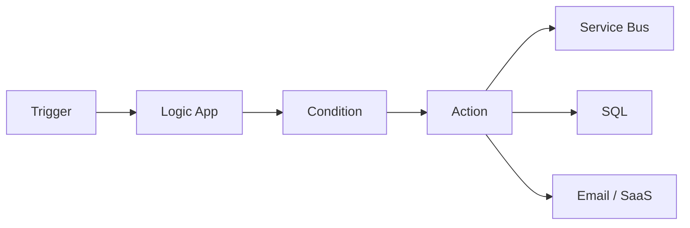

### Good use cases

- Enterprise integrations
- Approval workflows
- Scheduled workflows
- Notifications
- SaaS integrations
- File movement

---

## Q36. How do you connect a Logic App to Key Vault?

**One-line answer:** Give the Logic App's managed identity permission to read the required Key Vault secret and use the Key Vault connector/action.

```mermaid
flowchart LR
    A[Logic App] --> B[Managed Identity]
    B --> C[Key Vault]
    C --> D[Secret]
```

### Security principle

Use:

```text
Managed Identity → RBAC → Key Vault
```

instead of:

```text
Hard-coded secret → Logic App
```

---

## Q37. What is Azure Data Factory?

**One-line answer:** Azure Data Factory is a managed data integration and orchestration service for moving, transforming and scheduling data pipelines.

```mermaid
flowchart LR
    A[(SQL)] --> B[ADF Pipeline]
    C[(Blob)] --> B
    D[(SaaS)] --> B
    B --> E[Transform]
    E --> F[(Data Lake / Warehouse)]
```

### Core concepts

- Pipelines
- Activities
- Datasets
- Linked services
- Integration Runtime
- Triggers
- Parameters
- Monitoring

---

# 8. 📦 Containers and Azure OpenAI

## 🔄 Additional Azure Data Factory Interview Questions

The following questions are especially useful for **Senior, Principal and Solution Architect interviews**, because they test whether you understand ADF beyond simply saying "it is an ETL service."

---

## Q38. What is the difference between Azure Data Factory and Azure Databricks?

**One-line answer:** ADF is primarily an orchestration/data integration service, while Databricks is a compute and analytics platform used for complex transformations, Spark processing and data engineering.

| Requirement | ADF | Databricks |
|---|---:|---:|
| Pipeline orchestration | ✅ | Possible |
| Data movement | ✅ | Possible |
| Visual ETL | ✅ | ❌ |
| Complex Spark transformations | ❌ | ✅ |
| Large-scale data engineering | Limited | ✅ |
| Workflow scheduling | ✅ | ✅ |
| Notebook-based processing | ❌ | ✅ |

### Strong interview answer

> "I would normally use ADF as the orchestration layer and Databricks as the compute layer when transformations require distributed Spark processing."

```mermaid
flowchart LR
    A[ADF Pipeline] --> B[Copy Activity]
    A --> C[Databricks Notebook]
    C --> D[Transform with Spark]
    D --> E[(Data Lake)]
```

---

## Q39. What are Linked Services, Datasets and Pipelines in ADF?

**One-line answer:** Linked Services define connections, Datasets describe data structures/locations, and Pipelines orchestrate activities.

### Think of them as

```text
Linked Service = HOW do I connect?
Dataset        = WHAT data am I accessing?
Pipeline       = WHAT should I do with it?
Activity       = WHAT individual operation should run?
```

### Example

```mermaid
flowchart TD
    A[Pipeline] --> B[Copy Activity]
    B --> C[Source Dataset]
    C --> D[Source Linked Service]
    B --> E[Sink Dataset]
    E --> F[Sink Linked Service]
```

---

## Q40. What is Integration Runtime in Azure Data Factory?

**One-line answer:** Integration Runtime is the compute/integration infrastructure ADF uses to move data, execute activities and connect to data sources.

### Main types

| Runtime | Purpose |
|---|---|
| Azure IR | Cloud-based data movement |
| Self-hosted IR | Access on-prem/private network resources |
| Azure-SSIS IR | Run SSIS packages in Azure |

### Architecture

```mermaid
flowchart LR
    A[ADF Pipeline] --> B{Integration Runtime}
    B --> C[Azure IR]
    B --> D[Self-hosted IR]
    B --> E[Azure-SSIS IR]
    D --> F[On-Prem SQL / File Server]
    C --> G[Azure Storage]
```

---

## Q41. How do you connect ADF to an on-premises SQL Server?

**One-line answer:** Install a Self-hosted Integration Runtime inside the network that can reach SQL Server, then configure the ADF linked service to use it.

```mermaid
flowchart LR
    A[Azure Data Factory] --> B[Self-hosted IR]
    B --> C[Corporate Network]
    C --> D[(On-Prem SQL Server)]
```

### Production considerations

1. Install SHIR on a suitable VM.
2. Configure outbound connectivity.
3. Grant minimum SQL permissions.
4. Configure linked service.
5. Test connectivity.
6. Monitor IR health.
7. Use multiple SHIR nodes for availability where required.

---

## Q42. How do you implement an incremental load in Azure Data Factory?

**One-line answer:** Use a watermark such as `LastModifiedDate` or an increasing ID, retrieve only records changed since the previous successful run, and update the watermark after successful processing.

### Flow

```mermaid
flowchart TD
    A[Read Last Watermark] --> B[Source Query]
    B --> C[WHERE ModifiedDate > Watermark]
    C --> D[Copy Changed Records]
    D --> E[Validate / Transform]
    E --> F[Load Target]
    F --> G[Update Watermark]
```

### Example query

```sql
SELECT *
FROM Orders
WHERE ModifiedDate > @LastWatermark
  AND ModifiedDate <= @CurrentWatermark;
```

### Important

Do **not** update the watermark before the target load succeeds.

---

## Q43. How do you make an ADF pipeline reusable for multiple tables?

**One-line answer:** Parameterize the pipeline and use metadata-driven configuration rather than creating a separate pipeline for every table.

### Metadata example

```json
{
  "sourceTable": "Orders",
  "targetPath": "silver/orders",
  "watermarkColumn": "ModifiedDate",
  "loadType": "incremental"
}
```

### Architecture

```mermaid
flowchart LR
    A[(Metadata Table)] --> B[ADF Lookup]
    B --> C[ForEach]
    C --> D[Parameterized Copy Pipeline]
    D --> E[(Data Lake)]
```

**Principal Engineer insight:** Metadata-driven pipelines reduce duplication and make onboarding new sources primarily a configuration change.

---

## Q44. How do you handle failures and retries in Azure Data Factory?

**One-line answer:** Configure activity retry policies for transient failures, capture failure details, use dependency conditions, and route unrecoverable failures to an operational workflow.

```mermaid
flowchart TD
    A[ADF Activity] --> B{Success?}
    B -- Yes --> C[Next Activity]
    B -- No --> D{Retryable?}
    D -- Yes --> E[Retry]
    E --> A
    D -- No --> F[Failure Path]
    F --> G[Alert / Incident]
```

### Retry candidates

- Temporary network errors
- Throttling
- Transient service errors

### Don't blindly retry

- Invalid SQL
- Missing table
- Invalid credentials
- Schema mismatch
- Bad business data

---

## Q45. How do you monitor an ADF pipeline in production?

**One-line answer:** Monitor pipeline/activity runs, duration, failures, Integration Runtime health, throughput and data movement, with Azure Monitor alerts for important operational thresholds.

### Monitor

```text
Pipeline success/failure
Activity duration
Rows read/written
Data volume
Copy throughput
Integration Runtime health
Trigger failures
Dependency failures
```

### Operational flow

```mermaid
flowchart LR
    A[ADF] --> B[Pipeline Metrics]
    B --> C[Azure Monitor]
    C --> D[Alert]
    D --> E[Teams / Email / Incident System]
```

---

## Q46. An ADF pipeline suddenly becomes slow. How do you troubleshoot it?

**One-line answer:** Identify which activity became slow, then isolate source latency, Integration Runtime capacity, network throughput, sink throttling and transformation performance.

### Troubleshooting sequence

1. Compare current run duration with historical runs.
2. Find the slow activity.
3. Check source query performance.
4. Check Integration Runtime.
5. Check network/private connectivity.
6. Check destination throttling.
7. Check partitioning/parallel copy settings.
8. Check Databricks/Spark execution if used.
9. Check recent schema/configuration changes.

```mermaid
flowchart TD
    A[Pipeline Slow] --> B[Identify Slow Activity]
    B --> C{Source?}
    C -- Yes --> D[Optimize Source Query]
    C -- No --> E{Network / IR?}
    E -- Yes --> F[Check IR / Connectivity]
    E -- No --> G{Sink?}
    G -- Yes --> H[Check Throttling / Indexes]
    G -- No --> I[Check Transform]
```

---

## Q47. How do you pass parameters from an ADF pipeline to a Databricks notebook?

**One-line answer:** Define pipeline parameters and pass them to the Databricks notebook activity as base parameters.

### Example

```json
{
  "tableName": "orders",
  "loadDate": "2026-10-07",
  "loadType": "incremental"
}
```

Databricks can then read the values as notebook parameters.

### Flow

```mermaid
flowchart LR
    A[ADF Pipeline Parameter] --> B[Databricks Activity]
    B --> C[Notebook Parameter]
    C --> D[Spark Transformation]
```

---

## Q48. What is the difference between ADF Copy Activity and Mapping Data Flow?

**One-line answer:** Copy Activity is primarily for moving data, while Mapping Data Flow provides visual, managed transformations over data.

| Capability | Copy Activity | Mapping Data Flow |
|---|---:|---:|
| Data movement | ✅ | ✅ |
| Simple mappings | ✅ | ✅ |
| Complex transformations | Limited | ✅ |
| Join/Aggregation | Limited | ✅ |
| Visual transformation | ❌ | ✅ |
| Best for simple ingestion | ✅ | Sometimes |

### Rule of thumb

```text
Move data → Copy Activity
Transform data visually → Mapping Data Flow
Complex Spark transformation → Databricks
```

---

## Q49. How do you handle schema drift in ADF?

**One-line answer:** Detect schema changes explicitly and use schema-drift capabilities where appropriate, but protect critical downstream contracts with validation and controlled evolution.

### Production approach

```mermaid
flowchart TD
    A[Source Schema] --> B[Schema Detection]
    B --> C{Expected Change?}
    C -- Yes --> D[Accept / Map]
    C -- No --> E[Quarantine / Alert]
    D --> F[Target]
```

**Important:** Automatic schema drift is useful for flexible ingestion, but blindly propagating source schema changes into critical production tables can create downstream failures.

---

## Q50. How do you design a production-grade ADF pipeline?

**One-line answer:** Design it to be parameterized, metadata-driven, idempotent, observable, retryable, secure and restartable.

### Production checklist

- ✅ Parameterized pipelines
- ✅ Metadata-driven ingestion
- ✅ Incremental loading
- ✅ Idempotent processing
- ✅ Retry policies
- ✅ Failure paths
- ✅ Alerts
- ✅ Key Vault / Managed Identity
- ✅ Self-hosted IR HA where required
- ✅ Source/sink validation
- ✅ Audit logging
- ✅ Pipeline run correlation IDs
- ✅ Controlled schema evolution
- ✅ CI/CD with Git integration
- ✅ Separate dev/test/prod environments

### Production architecture

```mermaid
flowchart TD
    A[Source Systems] --> B[ADF]
    B --> C[Metadata / Configuration]
    B --> D[Copy Activity]
    B --> E[Databricks]
    D --> F[(ADLS)]
    E --> F
    F --> G[Curated Data]
    B --> H[Azure Monitor]
    H --> I[Alerts]
    B --> J[Key Vault / Managed Identity]
```

---

## Q51. What scaling does AKS support?

**One-line answer:** AKS supports pod-level horizontal scaling and cluster/node scaling, including HPA, Cluster Autoscaler and workload-aware scaling patterns such as KEDA.

### Scaling layers

```mermaid
flowchart TD
    A[Traffic] --> B[Ingress]
    B --> C[Service]
    C --> D[Pods]
    D --> E[HPA / KEDA]
    E --> F[More Pods]
    F --> G[Cluster Autoscaler]
    G --> H[More Nodes]
```

### Important distinction

- **HPA:** scales pods.
- **Cluster Autoscaler:** scales nodes.
- **KEDA:** scales workloads based on external/event-driven metrics.

---

## Q52. Which Azure container services have you used: Container Apps, AKS or Container Instances?

**One-line answer:** Choose based on operational complexity: Container Instances for simple isolated containers, Container Apps for managed container workloads, and AKS for advanced Kubernetes control and complex microservices platforms.

| Service | Best fit |
|---|---|
| Container Instances | Simple one-off containers |
| Container Apps | Serverless container applications |
| AKS | Kubernetes/microservices platform |
| Functions | Event-driven serverless compute |

### Interview answer example

> "For a microservices platform requiring Kubernetes networking, autoscaling, ingress and workload control, I would choose AKS; for simpler containerized APIs I would consider Container Apps."

---

## Q53. What was your use case for integrating Azure OpenAI?

**One-line answer:** I would use Azure OpenAI when an application needs enterprise-grade generative AI capabilities such as summarization, extraction, RAG or agent-assisted workflows while keeping Azure-native security and governance.

### Enterprise RAG flow

```mermaid
flowchart LR
    A[User] --> B[API]
    B --> C[Authentication]
    C --> D[RAG Orchestrator]
    D --> E[Query Embedding]
    E --> F[(Vector Search)]
    F --> G[Relevant Documents]
    G --> H[Prompt + Context]
    H --> I[Azure OpenAI]
    I --> J[Response]
    J --> K[Grounding / Guardrails]
    K --> A
```

### Example Python

```python
from openai import AzureOpenAI

client = AzureOpenAI(
    azure_endpoint="https://my-resource.openai.azure.com/",
    api_key="...",
    api_version="2024-10-21"
)

response = client.chat.completions.create(
    model="my-deployment",
    messages=[
        {"role": "system", "content": "Answer using supplied enterprise context."},
        {"role": "user", "content": "Summarize this document."}
    ],
    temperature=0
)

print(response.choices[0].message.content)
```

### Production considerations

- Ground responses with RAG.
- Validate retrieved context.
- Use prompt/version management.
- Implement content safety.
- Add token/cost controls.
- Measure latency.
- Build evaluation datasets.
- Log prompts/responses carefully while protecting sensitive data.
- Use Managed Identity and private networking where supported.

---

# 9. ⚡ Rapid Interview Cheat Sheet

| Question | Strong one-line answer |
|---|---|
| Azure Functions | Event-driven serverless compute |
| Durable Functions | Stateful orchestration for long-running workflows |
| Cold start | Initialization latency of a new function host |
| Service Bus | Reliable enterprise messaging |
| Event Hubs | High-throughput event streaming |
| Event Grid | Event notification and routing |
| Duplicate messages | Idempotency + duplicate detection |
| Ordered messages | Service Bus Sessions |
| Poison messages | Retry → DLQ → diagnose/replay |
| Large messages | Blob payload + Service Bus reference |
| Entra ID | Identity and OAuth/OIDC |
| Key Vault | Centralized secrets/keys/certificates |
| Managed Identity | Azure-managed workload identity |
| App Service | Managed PaaS hosting for web/API workloads |
| Application Insights | Application telemetry and distributed tracing |
| APIM | API gateway + policies + lifecycle |
| Front Door | Global Layer-7 application delivery |
| Blob Storage | Object/unstructured storage |
| Table Storage | NoSQL key-value/entity storage |
| Cosmos DB partition key | Controls data distribution and query locality |
| Logic Apps | Low-code integration/workflow |
| Data Factory | Data movement and orchestration |
| ADF vs Databricks | ADF orchestrates; Databricks provides Spark/compute |
| Integration Runtime | Compute/connectivity layer for ADF |
| Self-hosted IR | Connects ADF to private/on-prem resources |
| Incremental load | Watermark/change tracking + successful watermark update |
| Metadata-driven ADF | Parameterized reusable pipelines |
| Copy Activity | Data movement |
| Mapping Data Flow | Visual transformations |
| ADF failure handling | Retry transient failures + alert/escalate permanent failures |
| Schema drift | Controlled schema evolution with validation |
| AKS HPA | Scales pods |
| Cluster Autoscaler | Scales nodes |
| KEDA | Event-driven workload scaling |
| Azure OpenAI | Managed enterprise GenAI capability |

---

# 🎯 Principal Engineer Interview Pattern

For architecture questions, don't stop at naming an Azure service. Explain the **trade-off**.

Use this structure:

```text
1. Requirement
      ↓
2. Azure service choice
      ↓
3. Architecture
      ↓
4. Security
      ↓
5. Scalability
      ↓
6. Reliability
      ↓
7. Observability
      ↓
8. Cost
      ↓
9. Failure scenarios
```

### Example

> **"Why Service Bus instead of Event Hubs?"**

Don't answer only:

> "Service Bus is for messaging."

A stronger Principal Engineer answer is:

> "I would choose Service Bus because this workflow requires reliable command processing, retries, dead-lettering, duplicate handling and potentially ordered processing through sessions. If the requirement were high-volume telemetry with partition-based streaming and replay, I would choose Event Hubs instead."

---

# 🧠 Final Interview Rule

> **Don't memorize Azure services. Learn the problem each service solves.**

A strong Azure architect should be able to explain:

**Requirement → Service → Architecture → Trade-off → Failure → Security → Scale → Cost → Observability**

---

## 🏷️ Tags

`#AzureInterview` `#AzureFunctions` `#DurableFunctions` `#AzureServiceBus` `#EventHubs` `#EventGrid` `#EntraID` `#AzureKeyVault` `#AppService` `#ApplicationInsights` `#AzureAPIM` `#AzureFrontDoor` `#AzureStorage` `#CosmosDB` `#LogicApps` `#AzureDataFactory` `#AKS` `#AzureOpenAI` `#DotNet` `#CSharp` `#Python` `#CloudArchitecture` `#SystemDesign` `#PrincipalEngineer` `#StaffEngineer`
